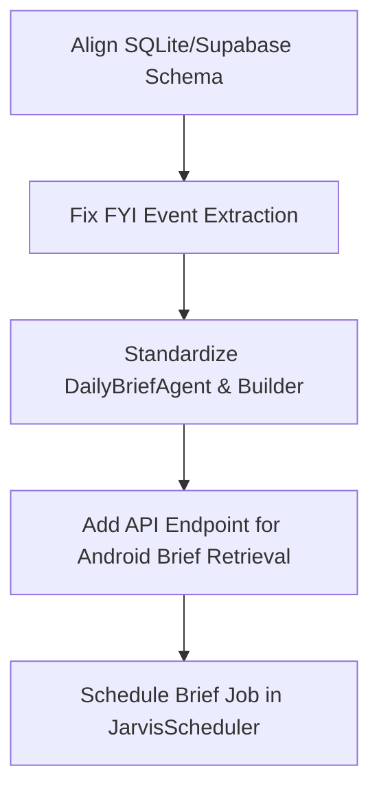

# Daily Brief Backend Audit

An audit of the Daily Brief subsystem inside the Jarvis backend codebase has been conducted to locate existing structures, logical flows, and identify gaps between SQLite definitions, Supabase schema definitions, pipeline orchestration, and tests.

---

## 1. Existing Tables and Schemas

There are two different schema paradigms for `daily_briefs` inside the backend codebase.

### A. The Core Model / DDL Schema (Supabase & SQLite Model)
The canonical SQL schema defined in [recreate_all_supabase_tables.sql](file:///home/prad/petprojects/ai/jarvis/sql/recreate_all_supabase_tables.sql#L278-L288) and the local SQLite model defined in [storage/models/daily_brief.py](file:///home/prad/petprojects/ai/jarvis/storage/models/daily_brief.py) map perfectly:

```python
class DailyBrief(LineageMixin, Base):
    __tablename__ = "daily_briefs"
    brief_id: Mapped[str] = mapped_column(String(36), primary_key=True)
    brief_type: Mapped[str] = mapped_column(String(50), nullable=False) # "MORNING" | "EVENING"
    generated_at: Mapped[datetime] = mapped_column(DateTime, nullable=False)
    content: Mapped[str] = mapped_column(Text, nullable=False)
    todo_count: Mapped[int] = mapped_column(Integer, nullable=False, default=0)
    fyi_count: Mapped[int] = mapped_column(Integer, nullable=False, default=0)
    fact_count: Mapped[int] = mapped_column(Integer, nullable=False, default=0)
```

### B. The Outdated/Alternative Model Schema
The alternative generator module ([services/daily_brief_generator.py](file:///home/prad/petprojects/ai/jarvis/services/daily_brief_generator.py)) and the synchronization logic ([services/supabase_sync_service.py](file:///home/prad/petprojects/ai/jarvis/services/supabase_sync_service.py)) assume a completely different schema structure for `DailyBrief` that **does not exist** in the model code or DDL:
*   `date`: VARCHAR/String field (used as a unique key for daily briefs).
*   `content_json`: Text/JSON field (used to store structured section payloads).
*   `sync_status`: VARCHAR field ("PENDING", "SYNCED").

*Any execution path hitting these attributes raises `AttributeError` or database exceptions.*

---

## 2. Existing APIs/Endpoints

*   **Daily Brief Retrieval APIs:** **Not implemented.** There are no endpoints for daily briefs in `api/routes/` or registered in `app/main.py`.
*   **Other Related APIs:**
    *   `/financial/summary` (GET): Retrieves the monthly spending summary.
    *   `/mobile/signals` (POST): Synchronizes signal data from the mobile device.

---

## 3. Existing Scheduled Jobs

*   **Scheduler Configuration:** Managed via `JarvisScheduler` ([orchestration/scheduler/scheduler.py](file:///home/prad/petprojects/ai/jarvis/orchestration/scheduler/scheduler.py)) using APScheduler.
*   **Active Jobs:** Only the `runtime_heartbeat` job is actively scheduled (every 30 seconds).
*   **Daily Brief Scheduled Jobs:** **Not implemented.** Although `DailyBriefAgent` is integrated as Stage B.4 inside `PipelineOrchestrator.run_pipeline()`, the orchestrator itself is run on a delayed thread at start and shutdown rather than scheduled on a recurring cron cadence inside `JarvisScheduler`.

---

## 4. Existing Android Sync Entities

*   **Signals Intake:** The schema defined in [api/schemas/mobile_sync.py](file:///home/prad/petprojects/ai/jarvis/api/schemas/mobile_sync.py) defines `MobileSignal` and `SyncRequest` (fields: `device_id`, `signals` list with `source`, `sender`, `message`, `timestamp`).
*   **Daily Brief Sync:** **Not implemented.** There are no schemas defined for sending generated briefs, updates, or lists back to the Android client.

---

## 5. Existing Prompt Templates

*   **Daily Brief LLM Prompts:** **Not implemented.** Both brief generation algorithms (`DailyBriefBuilder` and `DailyBriefGenerator`) build layout strings procedurally in Python using loops and string builders, bypassing LLM-based rendering.
*   **Other Subsystem Prompts:**
    *   `SignalUnderstandingAgent` ([services/signal_understanding_agent.py](file:///home/prad/petprojects/ai/jarvis/services/signal_understanding_agent.py)): Inline f-string template used to extract details from SMS/chats.
    *   `FinancialClassifier` ([services/financial_classifier.py](file:///home/prad/petprojects/ai/jarvis/services/financial_classifier.py)): Inline prompt used to categorize financial transactions.

---

## 6. Existing Brief Generation Logic

The backend has two completely separate implementations of Daily Brief rendering:

1.  **Core Agent Pipeline (`src/agents/daily_brief/agent.py`):**
    *   Generates a structured text Morning Brief and Evening Brief by querying SQLite tables (`TodoItem`, `FyiEvent`, `Fact`).
    *   Calls `DailyBriefBuilder` to assemble sections.
    *   Saves the record using `DailyBriefRepository` which mirrors writes to Supabase.
2.  **Legacy/Alternative Pipeline (`services/daily_brief_generator.py`):**
    *   Queries `Todo`, `FinancialEvent`, and `FyiEvent` by parsed target date.
    *   Constructs a dictionary containing sections for `todos`, `financial`, `fyi`, and `important_items`.
    *   Saves it to SQLite as JSON and triggers `SupabaseSyncService.sync_brief_for_date`.

---

## 7. Gap Analysis & Current State

### Daily Brief State: **Partially Implemented** (with critical schema and verification failures)

### Identified Gaps:
1.  **Schema and Extraction Crashes:**
    *   `services/signal_processor.py` fails during FYI event extraction because it tries to pass `fyi_type` and `content` keywords to `FyiEvent`, whereas the model expects `event_type` and `description`.
    *   `services/daily_brief_generator.py` and `services/supabase_sync_service.py` crash immediately due to missing attributes (`date`, `content_json`, `sync_status`) on the `DailyBrief` model.
2.  **Test Assertion Discrepancies:**
    *   `tests/test_daily_brief_agent.py` fails because it asserts string headers (`## Critical Actions`, `## Financial Updates`) that differ from the actual strings emitted by `DailyBriefBuilder` (`## Priority Actions`, `## Financial Snapshot`).
3.  **Missing Sync & API Layers:**
    *   There is no API endpoint for the Android client to retrieve generated briefs.
    *   The sync mechanism for the new agent-style `DailyBrief` model is not integrated with local file-uploads or bucket synchronization.

---

## Proposed Minimum-Change Path to Complete Backend Daily Briefs

To prepare the backend daily brief delivery system for Android consumption with minimum disruption:



### Action Items:
1.  **Align Model Schemas:**
    *   Deprecate `services/daily_brief_generator.py` and consolidate brief generation onto `src/agents/daily_brief/agent.py`.
    *   Fix the keyword mismatch in `services/signal_processor.py` line 645 to use correct `FyiEvent` fields (`event_type` instead of `fyi_type`, `description` instead of `content`).
2.  **Harmonize Tests:**
    *   Align assertion strings in `tests/test_daily_brief_agent.py` to match the outputs of `DailyBriefBuilder`.
3.  **Implement API Endpoint:**
    *   Create `api/routes/daily_brief.py` exposing a `GET /briefs/latest` or `GET /briefs/{date}` endpoint to serve the generated HTML/Markdown content to the mobile app.
4.  **Recurring Execution:**
    *   Register the `DailyBriefAgent` execution inside the `JarvisScheduler` to run every morning (e.g. 08:00 AM) and evening (e.g. 08:00 PM).
