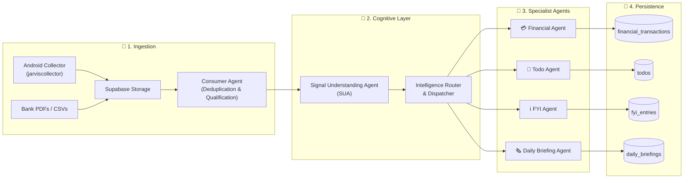

# 🧠 Jarvis Personal AI OS

> An autonomous, privacy-first personal AI operating system for unified signal ingestion, cognitive signal understanding, multi-agent intelligence routing, and automated life management.

---

## 🌟 Overview

**Jarvis Personal AI OS** is a multi-agent artificial intelligence framework designed to process ambient real-world signals—ranging from financial transactions, bank SMS notifications, and GPay receipts, to action items, notes, and informational alerts.

By combining deterministic fast-path metadata extraction with local LLM cognitive capabilities (`qwen2.5:1.5b`), Jarvis transforms raw multi-source streams into structured, domain-specific ledgers and daily executive summaries.

---

## 📱 Mobile Collector Integration

Jarvis pairs natively with the mobile collection background app:

* **Android App Repository**: 📲 [pradeepgithubrepo/jarviscollector](https://github.com/pradeepgithubrepo/jarviscollector)
* **Description**: Runs as a lightweight Android service intercepting financial SMS messages and transaction notifications on-device, securely transmitting JSON signal envelopes to Supabase storage buckets for automated ingestion.

---

## 🗺️ High-Level System Architecture



---

## 📚 Core Architecture Documentation Suite

Explore the detailed architecture, pipelines, and agent specifications under `docs/architecture/`:

| Document | Description | Key Focus Areas |
| :--- | :--- | :--- |
| 📥 **[01. Consumption Pipeline](docs/architecture/01_CONSUMPTION_PIPELINE.md)** | Data ingestion, file hashing, deduplication & qualification. | `jarviscollector`, SHA-256 dedup, qualification scoring rules. |
| 🧠 **[02. SUA & Signal Classification](docs/architecture/02_SUA_AND_SIGNAL_CLASSIFICATION.md)** | Signal Understanding & Analysis cognitive engine. | Metadata bypass, local LLM parsing, unified contracts, routing. |
| 🤖 **[03. Agent Ecosystem](docs/architecture/03_AGENT_ECOSYSTEM.md)** | Visual guide & breakdown of all 8 Jarvis AI agents. | Consumer, SUA, Financial, Financial Summary, Todo, FYI, Briefing, Lifecycle. |
| 📐 **[04. End-to-End System Architecture](docs/architecture/04_END_TO_END_SYSTEM_ARCHITECTURE.md)** | Topology, database schemas & system lifecycle. | Database ER diagrams, replay framework, backfill processing. |

---

## 📑 Historical & Technical Documentation Index (`docs/v2` & `docs/v2.1`)

The repository contains extensive technical deep-dives, migration blueprints, validation reports, and SQL schemas built during system development:

<details>
<summary><b>🔍 Expand Comprehensive Technical Index (20+ Specifications & Reports)</b></summary>

### 📥 Phase 1: Ingestion & Normalization (`docs/v2/phase1a-c`)
* 🎨 **Phase 1a Ingestion Design**: [DESIGN.md](docs/v2/phase1a/DESIGN.md)
* 🗄️ **Phase 1a Database Schema**: [SCHEMA.md](docs/v2/phase1a/SCHEMA.md)
* 📕 **Phase 1b PDF Parsing Spec**: [PDF_PARSING.md](docs/v2/phase1b/PDF_PARSING.md)
* 📊 **Phase 1c Dedup Validation**: [DEDUP_VALIDATION_REPORT.md](docs/v2/phase1c/DEDUP_VALIDATION_REPORT.md)
* 🔍 **Consumer Pipeline Forensic Report**: [CONSUMER_PIPELINE_FORENSIC_REPORT.md](docs/v2.1/consumer_pipeline/CONSUMER_PIPELINE_FORENSIC_REPORT.md)

### 🎯 Qualification Layer (`docs/v2/`)
* 📐 **Qualification Pipeline Blueprint**: [QUALIFICATION_PIPELINE_BLUEPRINT.md](docs/v2/QUALIFICATION_PIPELINE_BLUEPRINT.md)
* 🎨 **Qualification Layer V2 Design**: [QUALIFICATION_LAYER_V2_DESIGN.md](docs/v2/QUALIFICATION_LAYER_V2_DESIGN.md)
* 🗺️ **Qualification Migration Plan**: [QUALIFICATION_MIGRATION_PLAN.md](docs/v2/QUALIFICATION_MIGRATION_PLAN.md)
* 🛠️ **Qualification Schema Changes**: [QUALIFICATION_SCHEMA_CHANGES.sql](docs/v2/QUALIFICATION_SCHEMA_CHANGES.sql)

### 🧠 Phase 2: Understanding, LLM Benchmarks & Routing (`docs/v2/phase2a-b` & `understanding_layer`)
* 📐 **Understood Signals Blueprint V1**: [UNDERSTOOD_SIGNALS_BLUEPRINT_V1.md](docs/v2/understanding_layer/UNDERSTOOD_SIGNALS_BLUEPRINT_V1.md)
* 🧠 **Understanding Classification RCA**: [UNDERSTANDING_CLASSIFICATION_RCA.md](docs/v2/understanding_layer/UNDERSTANDING_CLASSIFICATION_RCA.md)
* 📊 **LLM Benchmark Report**: [LLM_BENCHMARK_REPORT.md](docs/v2/understanding_layer/LLM_BENCHMARK_REPORT.md)
* 📜 **Contract Schema Specification V1**: [CONTRACT_SCHEMA_V1.md](docs/v2/phase2b/CONTRACT_SCHEMA_V1.md)
* 🔀 **Dispatch Framework**: [DISPATCH_FRAMEWORK.md](docs/v2/phase2b/DISPATCH_FRAMEWORK.md)
* 🏗️ **Routing Architecture**: [ROUTING_ARCHITECTURE.md](docs/v2/phase2b/ROUTING_ARCHITECTURE.md)
* 🚦 **Routing Rules Spec**: [ROUTING_RULES.md](docs/v2/phase2b/ROUTING_RULES.md)
* 🔄 **Replay Framework**: [REPLAY_FRAMEWORK.md](docs/v2/phase2b/REPLAY_FRAMEWORK.md)

### 📝 Specialist Agents & Validation (`docs/v2/`)
* 📝 **Todo Agent Blueprint V1**: [TODO_AGENT_BLUEPRINT_V1.md](docs/v2/todo_agent/TODO_AGENT_BLUEPRINT_V1.md)
* 🎯 **Todo Agent Alignment Review**: [TODO_AGENT_ALIGNMENT_REVIEW.md](docs/v2/todo_agent/TODO_AGENT_ALIGNMENT_REVIEW.md)
* 📱 **Android Integration Spec**: [ANDROID_INTEGRATION_SPEC.md](docs/v2/todo_agent/ANDROID_INTEGRATION_SPEC.md)
* 📊 **Financial Summary Phase 1 Validation**: [FINANCIAL_SUMMARY_PHASE1_VALIDATION.md](docs/v2/FINANCIAL_SUMMARY_PHASE1_VALIDATION.md)
* 📈 **Pipeline Backfill Execution Report**: [PIPELINE_BACKFILL_EXECUTION_REPORT.md](docs/v2/PIPELINE_BACKFILL_EXECUTION_REPORT.md)

</details>

---

## 🛠️ Project Structure

```
jarvis/
├── README.md                      # GitHub Repository Frontage
├── docs/
│   ├── architecture/              # Core System Architecture Suite
│   │   ├── 01_CONSUMPTION_PIPELINE.md
│   │   ├── 02_SUA_AND_SIGNAL_CLASSIFICATION.md
│   │   ├── 03_AGENT_ECOSYSTEM.md
│   │   └── 04_END_TO_END_SYSTEM_ARCHITECTURE.md
│   ├── v2/                        # Historical V2 Architecture & Phase Reports
│   └── v2.1/                      # Forensic Pipeline Audits
├── src/
│   ├── agents/                    # Specialist & Core AI Agents
│   │   ├── consumer/              # Ingestion, Parsers & Qualification
│   │   ├── sua/                   # Signal Understanding & Contract Builder
│   │   ├── financial/             # Personal Finance & Transaction Specialist
│   │   ├── financial_summary/     # Expenditure Analytics & Rollups
│   │   ├── todo/                  # Action Item & Reminder Specialist
│   │   ├── fyi/                   # Contextual Knowledge & Info Alerts
│   │   ├── daily_briefing/        # Morning & Evening Digest Synthesis
│   │   └── lifecycle/             # System Supervisor & Backfill Orchestrator
│   └── intelligence/              # LLM Clients, Dispatchers & Routing Engine
├── config/                        # Qualification Rules & Domain Rules
└── tests/                         # End-to-End Pipeline & Agent Test Suites
```

---

## ⚡ Quickstart & Setup

### Prerequisites
* Python 3.10+
* [uv](https://github.com/astral-sh/uv) (Fast Python package manager)
* Ollama (with `qwen2.5:1.5b` model pulled for local offline execution)
* Supabase PostgreSQL Database

### Installation
```bash
# Clone repository
git clone https://github.com/pradeepgithubrepo/jarvis.git
cd jarvis

# Install dependencies using uv
uv sync

# Configure environment variables
cp .env.example .env
```

---

[📖 Start Exploring Architecture Docs →](docs/architecture/01_CONSUMPTION_PIPELINE.md)
