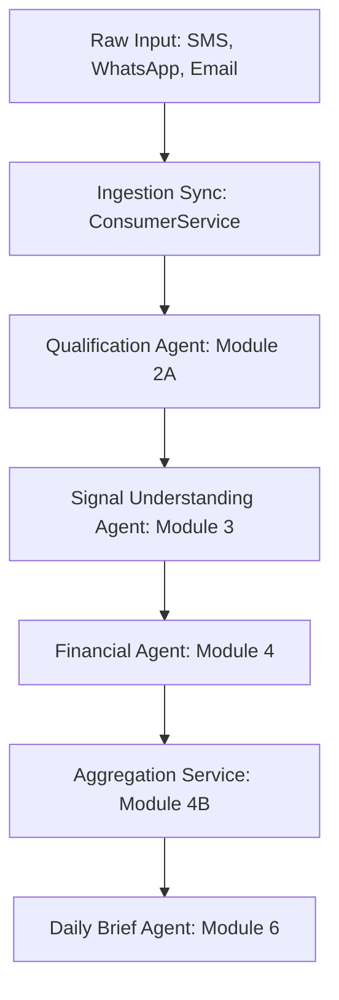

# AG System Assimilation Report

## Architecture Understanding

### System Purpose
The JARVIS AI OS is an agentic, decoupled processing pipeline that turns raw inputs (SMS, WhatsApp, emails) into structured, typed facts, actions, and daily briefs. It acts as a personal memory and financial ledger, keeping user data local, secure, and accurate.

### End-to-End Processing Flow

### Agent Responsibilities
- **ConsumerService (Module 1)**: Syncs and parses raw input streams, computes hashes, and saves them to `mobile_signals`.
- **Qualification Agent (Module 2A)**: Determines if a signal is high-value context or noise, and labels it.
- **Signal Understanding Agent (Module 3)**: Parses qualified signals into canonical semantic contracts.
- **Financial Agent (Module 4)**: Authoritative ledger processor for all confirmed monetary events. Produces typed `FinancialFact` records.
- **Aggregation Service (Module 4B)**: Computes monthly rollups (accounting spend, lifestyle spend, total income, etc.) based on financial facts.
- **Daily Brief Agent (Module 6)**: Compiles daily briefs of important events, tasks, and spending alerts.

### Ownership Boundaries
- **Single Writer Principle**: Every database table is written to by exactly one service.
- **Contract Boundary**: Downstream agents consume canonical understood contracts; they do not query raw tables.

### Locked Decisions
- **AD-1: Qualification Before LLM**: Filter noise deterministically before using LLMs.
- **AD-2: Deterministic Before LLM (SUA)**: Use regex/rules first, fallback to LLM.
- **AD-3: One Owner Per Table**: Prevent race conditions.
- **AD-4: Financial Agent Owns All Financial Tables**: Sole writer to financial events and facts.
- **AD-5: Aggregation Service Owns All Rollup Tables**: Keeps rollups idempotent.

### Current Roadmap
1. Complete Module 4 (Financial Agent & Aggregation) Stabilization.
2. Begin Module 5 (Todo Agent + FYI Agent) Design Review.

---

## Repository Mapping

| Module | Source Files | Services | Contracts | Dependencies | Entry Points |
|---|---|---|---|---|---|
| Ingestion | `consumer/` | `ConsumerService` | `mobile_signals` schema | `httpx`, `sqlalchemy` | `ConsumerService.run_sync()` |
| Qualification | `services/signal_qualification_agent.py` | `SignalQualificationAgent` | `qualified_signals` | `storage.models` | `SignalQualificationAgent.qualify_all_unprocessed_signals()` |
| Understanding | `services/signal_understanding_agent.py`, `services/rules_engine.py` | `SignalUnderstandingAgent` | `understood_signals` | `IntelligenceRouter` | `SignalUnderstandingAgent.process_signal()` |
| Financial Agent | `services/financial_agent.py` | `FinancialAgent` | `financial_facts` | `storage.models` | `FinancialAgent.process_contract()` |
| Aggregation | `services/aggregation_service.py` | `AggregationService` | `monthly_spending_summary` | `storage.models` | `AggregationService.run_all()` |

---

## Architecture Alignment

| Module | Expected Architecture | Actual Implementation | Alignment Status |
|---|---|---|---|
| Qualification | Deterministic rule qualification | Fully aligned | **Aligned** |
| Understanding | Decoupled rule + LLM contract generation | Runs in shadow mode in orchestrator | **Minor Deviation** (Needs full activation) |
| Financial Agent | Single-contract processing + batch finalization | Core exists, but fails on circular imports | **Moderate Deviation** (Direct import issue) |
| Aggregation | V2 split views, schema matches V2 | SQLite lacks V2 schema in active db | **Critical Deviation** (Schema out of sync) |

---

## Financial Agent Review & Gap Analysis

### Gap 1: Direct Import Failure
- **Root Cause**: Circular/missing ForeignKey references when SQLAlchemy attempts to resolve foreign keys for `financial_facts.qualified_signal_id` before `QualifiedSignal` is imported.
- **Files Affected**: [__init__.py](file:///home/prad/petprojects/ai/jarvis/storage/models/__init__.py)
- **Recommended Fix**: Import all models inside `storage/models/__init__.py` to force registration.
- **Estimated Effort**: 5 minutes.

### Gap 2: Processing Failures on Null Values
- **Root Cause**: `entities.monetary_value` being `null` or missing, causing crashed processing due to unchecked attribute access and type additions on `None` values.
- **Files Affected**: [financial_agent.py](file:///home/prad/petprojects/ai/jarvis/services/financial_agent.py)
- **Recommended Fix**: Add null-coalescing and type guards.
- **Estimated Effort**: 30 minutes.

### Gap 3: Missing V2 Schema Columns in SQLite
- **Root Cause**: The SQLite database was not updated with V2 aggregation columns like `accounting_spend` and `lifestyle_spend`.
- **Files Affected**: [database.py](file:///home/prad/petprojects/ai/jarvis/storage/db/database.py)
- **Recommended Fix**: Ensure migration path runs inside `initialize_database()`.
- **Estimated Effort**: 15 minutes.
