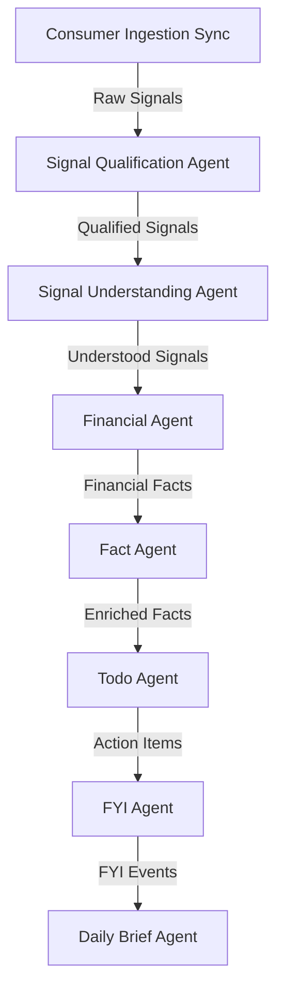

# Agent Interaction Matrix

**Date:** 2026-06-28  
**Component:** Jarvis AI OS Architecture Reference  

---

## 1. End-to-End Agent Flow

The Jarvis AI OS follows a sequential pipeline structure where raw input signals are ingested, qualified, parsed, categorized into memory, and finally compiled into actionable tasks, system FYI notifications, and briefs.

---

## 2. Agent Ownership Matrix

| Agent Name | Purpose | Inputs | Outputs | Owned Tables | Owned Contracts |
| :--- | :--- | :--- | :--- | :--- | :--- |
| **Consumer Service** | Ingests raw data from external streams (Android SMS, notifications) | Raw files, API streams | Raw signals, registered files | `signals`, `processed_files`, `mobile_signals` | Raw Signal Contract |
| **Signal Qualification Agent** | Filters noise, system notices, and duplicates from signals | Raw signals | Qualified signals | `qualified_signals` | Qualification Contract |
| **Signal Understanding Agent (SUA)** | Parses semantics, entities, and intent categories | Qualified signals | Understood signals, intent models | `understood_signals` | Understanding Contract (JSON schema) |
| **Financial Agent** | Resolves merchants, extracts transactions, and determines financial subtypes | Understood signals (Financial) | Financial facts, transfer pairs, salary review events | `financial_facts`, `financial_events`, `transfer_pairs`, `salary_events`, `salary_sources`, `merchant_profiles` | Financial Fact Contract |
| **Fact Agent** | Manages canonical long-term memory, relationships, and user/asset profiles | Understood signals, financial facts | Stateful memory records | `facts`, `fact_relationships` | Fact Contract |
| **Todo Agent** | Identifies, prioritizes, deduplicates, and enriches actionable user items | Understood signals, financial facts, memory facts | Stateful task items | `todo_items` | Todo Contract |
| **FYI Agent** (Active Dev) | Tracks notifications, non-actionable reminders, and system status updates | Understood signals, memory facts | Read-status managed FYI events | `fyi_events` | FYI Contract |
| **Daily Brief Agent** (Future) | Compiles, summarizes, and groups tasks and events for the user brief | Todo items, FYI events, financial facts, memory facts | Unified daily brief view | `daily_briefs` | Brief Contract |

---

## 3. Producer → Consumer Matrix

### Signal Understanding Agent (SUA)
* **`→ Financial Agent`**: Sends parsed entities, monetary values, and merchant names.
* **`→ Fact Agent`**: Sends parsed identity records (spouse, child names, insurance providers) to seed memory.
* **`→ Todo Agent`**: Sends signals categorized as `ACTION` to trigger task creation.
* **`→ FYI Agent`**: Sends informative notifications categorized as `INFORMATION` or `ALERT`.

### Financial Agent
* **`→ Fact Agent`**: Pushes merchant canonicals, insurance payments, bank accounts, and salary events to memory.
* **`→ Todo Agent`**: Pushes credit card dues, EMI reminders, failed payments, and refund tracking events as task candidates.

### Fact Agent
* **`→ Todo Agent`**: Enriches candidate todo titles and descriptions with canonical memory data (e.g. mapping policy numbers or vehicle license plates).
* **`→ FYI Agent`**: Supplies profile details to customize alert preferences.
* **`→ Daily Brief Agent`**: Provides validation cards for unconfirmed facts or profile changes.

### Todo Agent
* **`→ Daily Brief Agent`**: Supplies categorized tasks (Critical, Overdue, Upcoming) for the unified user brief.

### FYI Agent
* **`→ Daily Brief Agent`**: Supplies system FYI notices and informative alerts for the summary brief.

---

## 4. Contract Dependency Matrix

### Qualification Contract
* **Producer Agent:** Signal Qualification Agent
* **Consumer Agents:** Signal Understanding Agent

### Understanding Contract
* **Producer Agent:** Signal Understanding Agent
* **Consumer Agents:** Financial Agent, Fact Agent, Todo Agent, FYI Agent

### Financial Fact Contract
* **Producer Agent:** Financial Agent
* **Consumer Agents:** Fact Agent, Todo Agent, Daily Brief Agent

### Fact Contract
* **Producer Agent:** Fact Agent
* **Consumer Agents:** Todo Agent, FYI Agent, Daily Brief Agent

### Todo Contract
* **Producer Agent:** Todo Agent
* **Consumer Agents:** Daily Brief Agent

### FYI Contract
* **Producer Agent:** FYI Agent
* **Consumer Agents:** Daily Brief Agent

---

## 5. Database Ownership Matrix

To maintain integrity and prevent concurrency conflicts, each table follows the **Single Owner Principle** for writes, while allowing other agents to read.

* **`mobile_signals` & `signals`**
  * *Owner:* Consumer Service
  * *Read Consumers:* Signal Qualification Agent
* **`qualified_signals`**
  * *Owner:* Signal Qualification Agent
  * *Read Consumers:* Signal Understanding Agent
* **`understood_signals`**
  * *Owner:* Signal Understanding Agent
  * *Read Consumers:* Financial Agent, Fact Agent, Todo Agent, FYI Agent
* **`financial_facts`, `financial_events`, `transfer_pairs`, `salary_events`, `salary_sources`, `merchant_profiles`**
  * *Owner:* Financial Agent
  * *Read Consumers:* Fact Agent, Todo Agent, Aggregation Service
* **`facts` & `fact_relationships`**
  * *Owner:* Fact Agent
  * *Read Consumers:* Todo Agent, FYI Agent, Daily Brief Agent
* **`todo_items`**
  * *Owner:* Todo Agent
  * *Read Consumers:* Daily Brief Agent
* **`fyi_events`**
  * *Owner:* FYI Agent
  * *Read Consumers:* Daily Brief Agent
* **`daily_briefs`**
  * *Owner:* Daily Brief Agent
  * *Read Consumers:* Streamlit UI, Android Client

---

## 6. Future Module Readiness

### Current Locked Modules
1. **Qualification Agent** (LOCKED)
2. **Signal Understanding Agent** (LOCKED)
3. **Financial Agent** (LOCKED)
4. **Fact Agent** (LOCKED - locally and synced to Supabase)
5. **Todo Agent** (LOCKED - locally and synced to Supabase)

### Current Active Development
* **FYI Agent** (Next Module implementation)

### Future Modules
* **Daily Brief Agent**
* **Routing Engine & UI**
