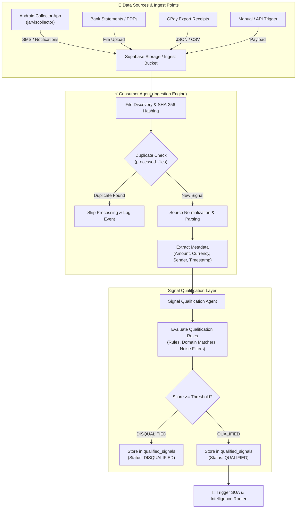
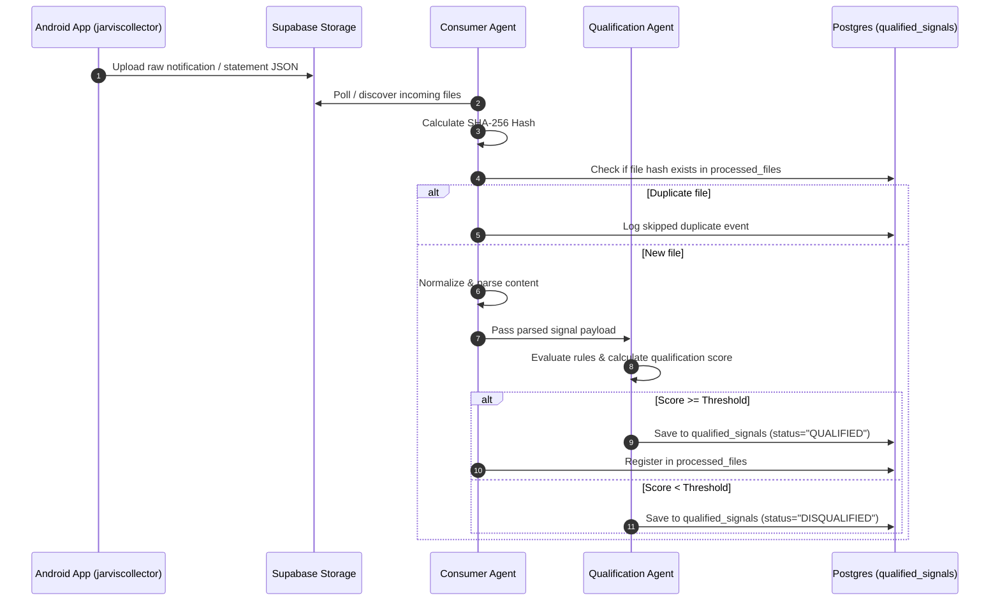

# 📥 Consumption & Data Ingestion Pipeline

The **Consumption Pipeline** is the first operational stage of the **Jarvis Personal AI OS**. It handles raw data ingestion from mobile devices, web hooks, raw file storage, and financial statement uploads, standardizing multi-source signals before passing them downstream for qualification and intelligence analysis.

---

## 🏗️ Architecture Overview

---

## 📲 Mobile Collector Integration: `jarviscollector`

Data collection on mobile devices is powered by the open-source **Jarvis Collector Android App**.

* **Repository**: [pradeepgithubrepo/jarviscollector](https://github.com/pradeepgithubrepo/jarviscollector)
* **Role**: Runs as a lightweight background service on Android devices to listen for incoming bank SMS messages, payment gateway notifications (GPay, PhonePe, Paytm), and transactional notifications.
* **Payload Contract**: Signals are structured into JSON envelopes containing payload metadata, raw body, sender headers, and UTC timestamps, then securely transmitted to Supabase storage buckets.

For full Android integration specs, consult [ANDROID_INTEGRATION_SPEC.md](../v2/todo_agent/ANDROID_INTEGRATION_SPEC.md).

---

## ⚙️ Key Processing Stages

### 1. File Discovery & Deduplication
The `ConsumerAgent` periodically polls or listens to Supabase storage buckets (`discover_files`). To prevent processing duplicate files or redundant notifications:
1. Calculates SHA-256 hash of raw bytes via `calculate_hash()`.
2. Queries `processed_files` table via `check_duplicate()`.
3. Skips already-processed content, saving compute and preventing downstream ledger duplicate entries.

### 2. Normalization & Parsing
Raw incoming files are processed by dedicated normalizers and parsers located under `src/agents/consumer/normalizers/` and `src/agents/consumer/parsers/`:
* **PDF Parser**: Extracts tabular bank statement records and converts text to standard schema.
* **GPay Normalizer**: Extracts payment counterparty, payment channel, transaction ID, and currency.
* **SMS Normalizer**: Sanitizes SMS body text, strips null bytes (`clean_null_bytes`), and extracts sender aliases.

### 3. Signal Qualification Agent
The `SignalQualificationAgent` (`src/agents/consumer/qualification_agent.py`) evaluates raw signals using context rules stored in `config/`:
* `qualification_rules.json`: System filtering rules.
* `family_context.json`: Sender whitelist and family domain identifiers.
* `high_value_domains.json`: High-priority financial and operational domain patterns.

#### Qualification Scoring Matrix
| Signal Type | Evaluation Logic | Qualification Action |
| :--- | :--- | :--- |
| **Structured GPay / Bank** | Valid amount, currency, and counterparty metadata | Automatic **100% Score** & `QUALIFIED` status |
| **Financial SMS** | Matches debit/credit keywords & bank sender code | **Qualified** (Score >= 70.0) |
| **System / Promo SMS** | OTPs, marketing spam, operator recharges | **Disqualified** (Score < 40.0) |
| **Actionable Reminders** | Contains deadlines, task keywords, family context | **Qualified** (Score >= 60.0) |

---

## 🔄 Ingestion Sequence Diagram

---

## 📑 Deep-Dive & Historical References

For historical design blueprints, schema migrations, and validation reports related to the Consumption Pipeline, refer to the following documents in `docs/v2/` and `docs/v2.1/`:

* 📐 **Pipeline Blueprint**: [QUALIFICATION_PIPELINE_BLUEPRINT.md](../v2/QUALIFICATION_PIPELINE_BLUEPRINT.md)
* 🎨 **Qualification Layer Design**: [QUALIFICATION_LAYER_V2_DESIGN.md](../v2/QUALIFICATION_LAYER_V2_DESIGN.md)
* 🗺️ **Migration Plan**: [QUALIFICATION_MIGRATION_PLAN.md](../v2/QUALIFICATION_MIGRATION_PLAN.md)
* 🔍 **Forensic Report**: [CONSUMER_PIPELINE_FORENSIC_REPORT.md](../v2.1/consumer_pipeline/CONSUMER_PIPELINE_FORENSIC_REPORT.md)
* 📄 **Phase 1a Ingestion Design**: [Phase 1a Design Doc](../v2/phase1a/DESIGN.md)
* 📕 **Phase 1b PDF Parsing Spec**: [PDF Parsing Spec](../v2/phase1b/PDF_PARSING.md)
* 📊 **Phase 1c Dedup Validation**: [Dedup Validation Report](../v2/phase1c/DEDUP_VALIDATION_REPORT.md)

---

[← Return to Root README](../../README.md) | [Next: SUA & Signal Classification →](02_SUA_AND_SIGNAL_CLASSIFICATION.md)
