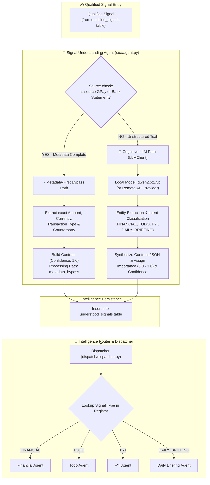
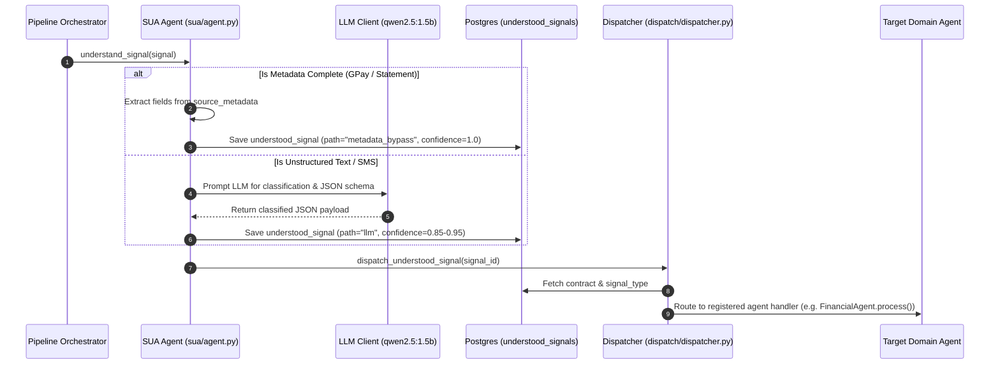

# 🧠 Signal Understanding & Analysis (SUA) & Classification

The **Signal Understanding & Analysis (SUA)** layer is the cognitive core of **Jarvis Personal AI OS**. It receives `QUALIFIED` signals from the Consumption Pipeline, extracts key semantic metadata, synthesizes unified **Intelligence Contracts**, and routes classified intent to specialized AI domain agents.

---

## 🏗️ Architecture & Dual-Path Engine

SUA operates a hybrid dual-path processing model contact_7ncing zero-latency structured execution with LLM intelligence for unstructured data.



---

## ⚡ Dual-Path Processing Breakdown

### Path A: Metadata-First Bypass (Deterministic, 1.0 Confidence)
When signals originate from structured sources such as bank PDF statements or Google Pay exports, the required data fields (amount, currency, counterparty, DEBIT/CREDIT) are already verified during ingestion.
* **Execution Time**: ~1ms (Zero LLM overhead)
* **Confidence Level**: `1.0` (100%)
* **LLM Used**: None (`llm_model_used: null`)
* **Contract Output**: Instantly constructs a clean schema-compliant financial transaction contract.

### Path B: LLM Cognitive Analysis (Probabilistic)
For unstructured inputs like bank SMS messages, email summaries, or ambient notifications:
1. **Model**: Utilizes `qwen2.5:1.5b` (or configured Ollama/OpenAI/Gemini providers via `LLMClient`).
2. **Entity Extraction**: `extract_entities()` extracts capitalized words, merchant names, account identifiers, and dates.
3. **Intent Classification**: Evaluates signal semantics to assign a primary target domain:
   * 💰 `FINANCIAL`: Debit/Credit notifications, bill payments, refund alerts.
   * 📝 `TODO`: Actionable task requests, bill due date reminders, follow-ups.
   * ℹ️ `FYI`: Informational updates, flight status, delivery notifications without explicit user actions.
   * 🗞️ `DAILY_BRIEFING`: Digest summary triggers or status updates.

---

## 📜 Unified Intelligence Contract Schema

Every understood signal is converted into a standard JSON payload stored in `understood_signals.contract_json`.

```json
{
  "signal_type": "FINANCIAL",
  "importance": 0.95,
  "confidence": 1.0,
  "summary": "Paid INR 450.00 to Swiggy",
  "reason": "Structured gpay metadata bypass",
  "processing_path": "metadata_bypass",
  "contract_json": {
    "amount": 450.00,
    "currency": "INR",
    "transaction_type": "DEBIT",
    "payment_channel": "UPI",
    "merchant": "Swiggy"
  }
}
```

---

## 🔄 SUA Processing Sequence Diagram



---

## 📑 Deep-Dive & Historical References

For detailed benchmark results, root cause analysis documents, and routing rules specifications, refer to these documents in `docs/v2/`:

* 📐 **Understood Signals Blueprint**: [UNDERSTOOD_SIGNALS_BLUEPRINT_V1.md](../v2/understanding_layer/UNDERSTOOD_SIGNALS_BLUEPRINT_V1.md)
* 🧠 **Classification RCA & Analysis**: [UNDERSTANDING_CLASSIFICATION_RCA.md](../v2/understanding_layer/UNDERSTANDING_CLASSIFICATION_RCA.md)
* 📊 **LLM Benchmark Report**: [LLM_BENCHMARK_REPORT.md](../v2/understanding_layer/LLM_BENCHMARK_REPORT.md)
* 📜 **Contract Schema Specification**: [CONTRACT_SCHEMA_V1.md](../v2/phase2b/CONTRACT_SCHEMA_V1.md)
* 🔀 **Dispatch Framework**: [DISPATCH_FRAMEWORK.md](../v2/phase2b/DISPATCH_FRAMEWORK.md)
* 🏗️ **Routing Architecture**: [ROUTING_ARCHITECTURE.md](../v2/phase2b/ROUTING_ARCHITECTURE.md)
* 🚦 **Routing Rules Specification**: [ROUTING_RULES.md](../v2/phase2b/ROUTING_RULES.md)

---

[← Consumption Pipeline](01_CONSUMPTION_PIPELINE.md) | [Return to Root README](../../README.md) | [Next: Agent Ecosystem →](03_AGENT_ECOSYSTEM.md)
