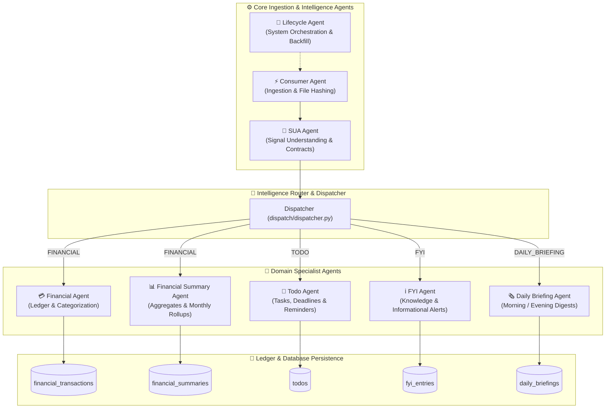

# 🤖 Jarvis AI Agent Ecosystem

The **Jarvis AI Agent Ecosystem** is built on a modular, event-driven, specialist architecture. Rather than relying on a single monolithic prompt, Jarvis delegates task domains to 8 specialized agents (`src/agents/`), each maintaining strict boundaries, custom contracts, and domain-specific state persistence.

---

## 🏛️ Ecosystem Architecture & Agent Map

---

## 👥 Specialist Agent Reference

Below is a brief, self-explanatory overview of each agent operating in the Jarvis system:

---

### 1. ⚡ Consumer Agent (`src/agents/consumer/agent.py`)
* **Role**: Data Ingestion & Deduplication Specialist.
* **Responsibilities**: Polling data storage buckets, calculating SHA-256 hashes, deduplicating incoming files against `processed_files`, executing source normalizers, and running the `SignalQualificationAgent`.
* **Outputs**: Filtered `qualified_signals` entries.

---

### 2. 🧠 Signal Understanding Agent (SUA) (`src/agents/sua/agent.py`)
* **Role**: Cognitive Classifier & Intelligence Contract Generator.
* **Responsibilities**: Analyzing raw qualified text via metadata fast-path or LLM (`qwen2.5:1.5b`), extracting entities/merchants/amounts, assigning confidence scores, and tagging `signal_type`.
* **Outputs**: Structured `understood_signals` with unified JSON contracts.

---

### 3. 💳 Financial Agent (`src/agents/financial/financial_agent.py`)
* **Role**: Personal Finance & Transaction Specialist.
* **Responsibilities**: Managing transactional ledgers, categorizing expenses (e.g., Dining, Utilities, Subscriptions, Transfer), linking counterparties, calculating category totals, and enforcing double-entry check balances.
* **Outputs**: Classified ledger records in `financial_transactions`.

---

### 4. 📊 Financial Summary Agent (`src/agents/financial_summary/`)
* **Role**: Financial Analytics & Rollup Specialist.
* **Responsibilities**: Aggregating weekly and monthly financial metrics, tracking net cash flow, comparing month-over-month expenditure, and validating database phase backfills.
* **Outputs**: Analytical rollups in `financial_summaries`.

---

### 5. 📝 Todo Agent (`src/agents/todo/todo_agent.py`)
* **Role**: Task Management & Reminder Specialist.
* **Responsibilities**: Extracting actionable todo items from incoming signals, parsing due dates and time contexts, setting priority tags, and syncing with external notification interfaces.
* **Outputs**: Actionable items in `todos` table.

---

### 6. ℹ️ FYI Agent (`src/agents/fyi/fyi_agent.py`)
* **Role**: Contextual Knowledge & Passive Information Specialist.
* **Responsibilities**: Capturing non-actionable information (e.g., flight status updates, package dispatch alerts, policy updates) and storing them for contextual reference without burdening task queues.
* **Outputs**: Structured knowledge in `fyi_entries`.

---

### 7. 🗞️ Daily Briefing Agent (`src/agents/daily_briefing/daily_briefing_agent.py`)
* **Role**: Executive Digest & Morning/Evening Summary Specialist.
* **Responsibilities**: Compiling cross-agent data into digestible daily briefs—combining daily expenditure summaries from Financial Agent, pending tasks from Todo Agent, and key alerts from FYI Agent.
* **Outputs**: Formatted digest records in `daily_briefings`.

---

### 8. 🔄 Lifecycle Agent (`src/agents/lifecycle/lifecycle_agent.py`)
* **Role**: System Orchestrator & Health Supervisor.
* **Responsibilities**: Monitoring background pipeline runs (`pipeline_runs`), triggering periodic cron jobs, orchestrating multi-stage backfills, and validating system integrity across all agents.
* **Outputs**: System health metrics and run logs in `pipeline_run_events`.

---

## 📑 Deep-Dive & Historical References

For individual agent blueprints, design walkthroughs, and alignment reports, check the following documents in `docs/v2/`:

* 📝 **Todo Agent Blueprint**: [TODO_AGENT_BLUEPRINT_V1.md](../v2/todo_agent/TODO_AGENT_BLUEPRINT_V1.md)
* 🎯 **Todo Agent Alignment Review**: [TODO_AGENT_ALIGNMENT_REVIEW.md](../v2/todo_agent/TODO_AGENT_ALIGNMENT_REVIEW.md)
* 🚶 **Todo Agent Walkthrough**: [TODO_AGENT_WALKTHROUGH.md](../v2/todo_agent/TODO_AGENT_WALKTHROUGH.md)
* 📱 **Android Integration Spec**: [ANDROID_INTEGRATION_SPEC.md](../v2/todo_agent/ANDROID_INTEGRATION_SPEC.md)
* 📊 **Financial Summary Phase 1 Validation**: [FINANCIAL_SUMMARY_PHASE1_VALIDATION.md](../v2/FINANCIAL_SUMMARY_PHASE1_VALIDATION.md)

---

[← SUA & Signal Classification](02_SUA_AND_SIGNAL_CLASSIFICATION.md) | [Return to Root README](../../README.md) | [Next: End-to-End System Architecture →](04_END_TO_END_SYSTEM_ARCHITECTURE.md)
