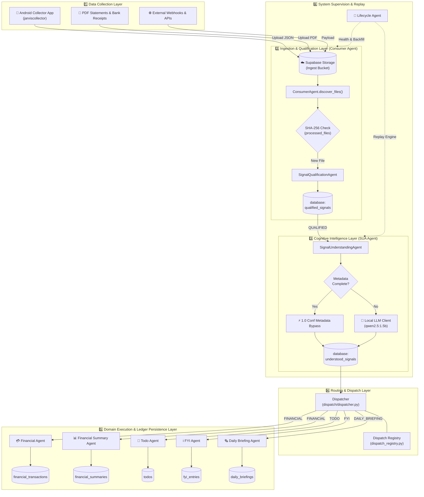
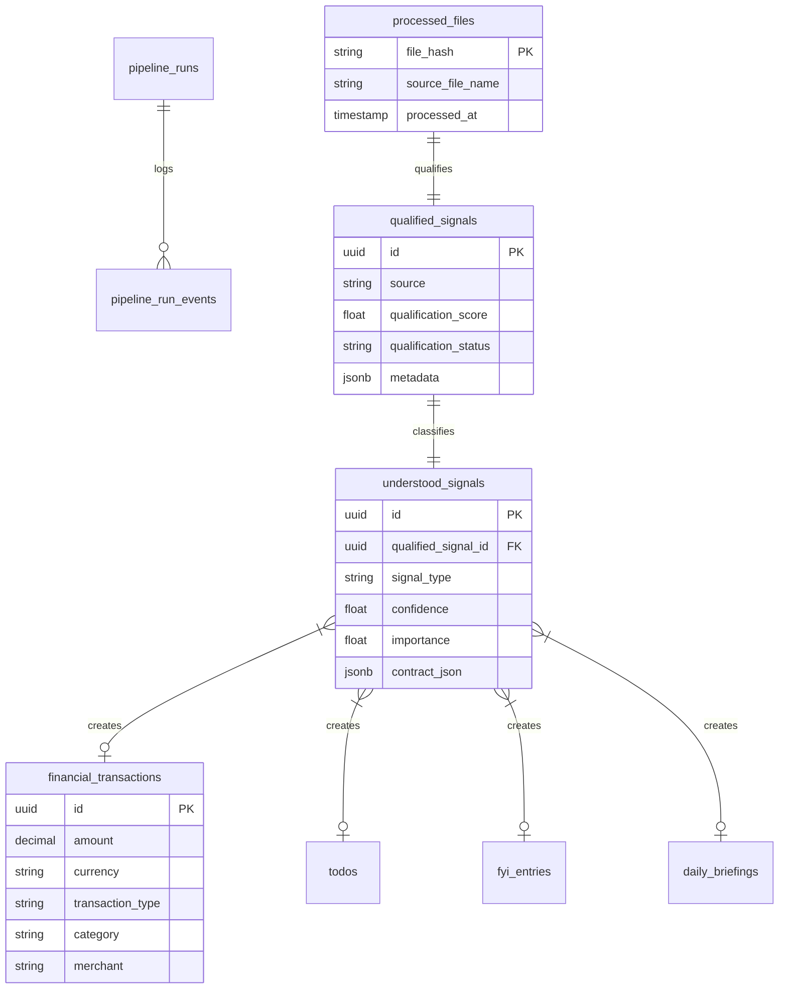

# 📐 End-to-End System Architecture & Data Lifecycle

This document provides a holistic blueprint of the **Jarvis Personal AI OS**, illustrating how hardware collectors, storage infrastructure, processing agents, intelligence routing, and domain ledgers interlock across the complete signal processing lifecycle.

---

## 🗺️ Complete End-to-End System Topology

---

## 💾 Primary Data Schema Relationships

The data persistence layer relies on Supabase PostgreSQL. Below is the simplified Entity-Relationship diagram illustrating signal flow through table states:

---

## 🔄 End-to-End Signal Execution Lifecycle

1. **Collection**: The mobile collector ([jarviscollector](https://github.com/pradeepgithubrepo/jarviscollector)) intercepts transactional SMS/notifications on Android devices and pushes structured JSON to Supabase.
2. **Ingestion & Dedup**: `ConsumerAgent` computes the SHA-256 digest of the payload. If unique, the file is logged in `processed_files` and passed to `SignalQualificationAgent`.
3. **Qualification**: `SignalQualificationAgent` applies heuristic domain context matching (`config/qualification_rules.json`). Qualified entries are inserted into `qualified_signals` with status `QUALIFIED`.
4. **Understanding (SUA)**: `SignalUnderstandingAgent` reads `QUALIFIED` signals. Structured inputs (GPay, Bank Statements) take the 1.0 confidence metadata bypass path. Unstructured SMS entries are parsed via Ollama/Local LLM (`qwen2.5:1.5b`). Output is saved in `understood_signals`.
5. **Dispatch**: `Dispatcher` matches `signal_type` in `dispatch_registry.py` and routes the contract to registered domain agent handlers.
6. **Execution & Ledger**: Target domain agents (`FinancialAgent`, `TodoAgent`, `FYIAgent`, `DailyBriefingAgent`) write domain-specific entities to dedicated database tables.
7. **Orchestration & Replay**: `LifecycleAgent` monitors pipeline health, executes historical backfills, and triggers the `Replay Framework` when rules or models are updated.

---

## 📑 Deep-Dive & Historical References

For comprehensive technical specifications, replay frameworks, backfill execution reports, and database schemas:

* 🔄 **Replay Framework**: [REPLAY_FRAMEWORK.md](../v2/phase2b/REPLAY_FRAMEWORK.md)
* 📊 **Pipeline Backfill Execution Report**: [PIPELINE_BACKFILL_EXECUTION_REPORT.md](../v2/PIPELINE_BACKFILL_EXECUTION_REPORT.md)
* 📜 **Phase 2b Validation Report**: [PHASE2B_VALIDATION_REPORT.md](../v2/phase2b/PHASE2B_VALIDATION_REPORT.md)
* 🗄️ **Phase 1a Core Database Schema**: [Phase 1a Schema](../v2/phase1a/SCHEMA.md)

---

[← Agent Ecosystem](03_AGENT_ECOSYSTEM.md) | [Return to Root README →](../../README.md)
