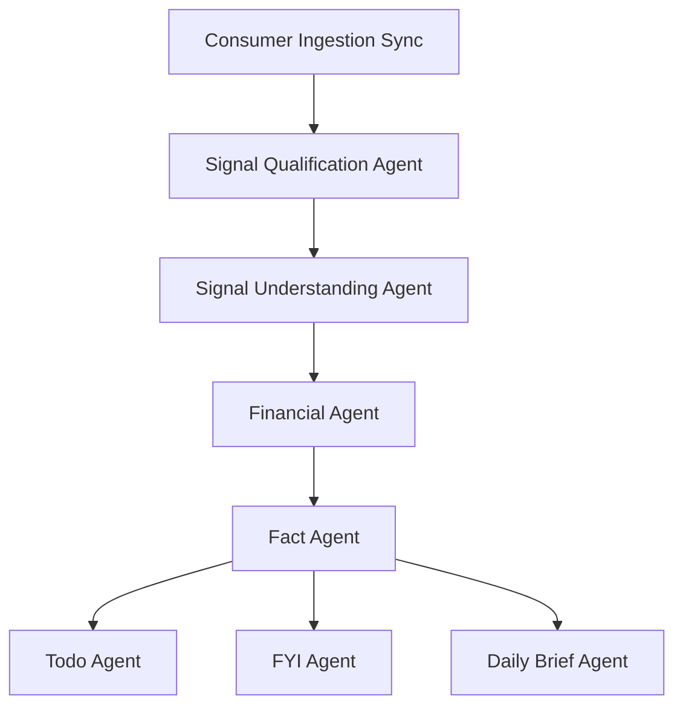
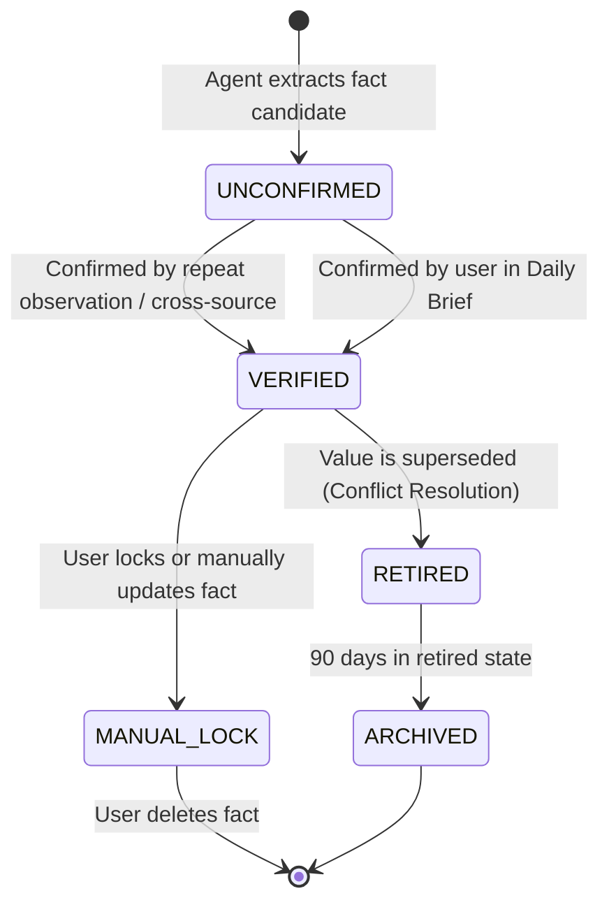

# Fact Agent Design Review

**Date:** 2026-06-28  
**Phase:** Module 5A - Fact Agent Design Review  
**Author:** Jarvis AI OS Architecture Group  

---

## 1. Executive Summary

As the Jarvis AI OS ecosystem scales, the system needs an authoritative, long-term memory layer that prevents agents from repeatedly rediscovering user information or stuffing context windows with redundant, raw notifications. The **Fact Agent** is designed to act as the canonical memory system of Jarvis. It normalizes, validates, links, and persists structured, non-financial facts about the user, their family, assets, preferences, and relationships.

Rather than running semantic parsing or downstream actions directly, the Fact Agent focuses entirely on **stateful knowledge management**. It transforms temporal transaction data and notifications into a structured, relational knowledge graph with automated confidence scoring, lifecycle tracking, and user-override support.

---

## 2. Fact Agent Architecture

The Fact Agent sits downstream of the understanding and transaction processing pipelines and upstream of active consumer-facing agents.

### Pipeline Placement


### Internal Flow
```mermaid
graph LN
    Input[Understood Signal / Financial Fact] --> Dedupe[Fact Deduplication & Matching]
    Dedupe --> ConfCalc[Confidence Evaluation]
    ConfCalc --> Conflict[Conflict Resolution Engine]
    Conflict --> Store[Fact & Relationship Ledger]
    Store --> Sync[Supabase Cloud Sync]
```

---

## 3. Canonical Fact Contract

To support polymorphism across different types of facts, the canonical fact structure utilizes a relational schema containing a JSON payload for category-specific attributes.

### SQLAlchemy Model Concept

```python
# storage/models/fact.py

import uuid
from datetime import datetime
from sqlalchemy import String, Float, Boolean, DateTime, JSON, ForeignKey
from sqlalchemy.orm import Mapped, mapped_column, relationship
from storage.models.base import Base

class Fact(Base):
    """
    The canonical long-term memory ledger for the Jarvis AI OS.
    Stores verified, stateful facts about the user's life, family, and assets.
    """
    __tablename__ = "facts"

    id: Mapped[str] = mapped_column(
        String(36), primary_key=True, default=lambda: str(uuid.uuid4())
    )

    # --- Categorization ---
    fact_type: Mapped[str] = mapped_column(
        String(50), nullable=False, index=True,
        comment="PERSON | FAMILY_MEMBER | BANK_ACCOUNT | VEHICLE | PREFERENCE | etc."
    )

    # --- Value (Category-Specific Attributes) ---
    fact_value: Mapped[dict] = mapped_column(
        JSON, nullable=False,
        comment="Structured payload (e.g. {'name': 'Charan', 'birthdate': '2015-05-12'})"
    )

    # --- Governance & Trust ---
    confidence: Mapped[float] = mapped_column(
        Float, nullable=False, default=0.5,
        comment="Confidence score between 0.0 (untrusted) and 1.0 (verified/locked)"
    )
    status: Mapped[str] = mapped_column(
        String(30), nullable=False, default="UNCONFIRMED",
        comment="UNCONFIRMED | VERIFIED | RETIRED | ARCHIVED | MANUAL_LOCK"
    )

    # --- Lineage & Auditing ---
    source_agent: Mapped[str] = mapped_column(
        String(50), nullable=False,
        comment="Agent that generated this fact (e.g., 'SUA', 'FinancialAgent')"
    )
    evidence: Mapped[dict] = mapped_column(
        JSON, nullable=True,
        comment="List of supporting signal_ids or fact_ids: {'signal_ids': [...], 'referenced_facts': [...]}"
    )

    # --- Temporal Attributes ---
    first_seen: Mapped[datetime] = mapped_column(
        DateTime, default=datetime.utcnow, nullable=False
    )
    last_seen: Mapped[datetime] = mapped_column(
        DateTime, default=datetime.utcnow, nullable=False
    )
    created_at: Mapped[datetime] = mapped_column(
        DateTime, default=datetime.utcnow, nullable=False
    )
```

---

## 4. Fact Taxonomy

Facts are categorized into strict, pre-defined types to ensure querying agents can reliably parse `fact_value` payloads.

| Fact Type | Description | JSON Structure Example (`fact_value`) |
| :--- | :--- | :--- |
| **`PERSON`** | The primary user details | `{"full_name": "Pradeep", "email": "pradeep@example.com"}` |
| **`FAMILY_MEMBER`**| Relatives and household members | `{"name": "Shobana", "relationship": "spouse", "birthdate": "1990-10-15"}` |
| **`BANK_ACCOUNT`** | Accounts owned by the family | `{"bank_name": "HDFC", "account_last_4": "4321", "owner_name": "Pradeep"}` |
| **`VEHICLE`** | Cars or bikes | `{"make": "Maruti Suzuki", "model": "Swift", "license_plate": "KA-03-XX-1234"}` |
| **`PROPERTY`** | Real estate and residences | `{"type": "primary_residence", "address": "123 Green Glen, Bangalore"}` |
| **`INSURANCE_POLICY`**| Insurance assets | `{"provider": "Acko", "policy_number": "POL-9876", "premium": 3141.0}` |
| **`SUBSCRIPTION`** | Active recurring services | `{"service": "Netflix", "tier": "Premium 4K", "price": 649.0, "cycle": "monthly"}` |
| **`PREFERENCE`** | User-specific settings/rules | `{"domain": "travel", "key": "airline_preference", "value": "Indigo"}` |
| **`CONTACT`** | Identified third-party contacts | `{"name": "Arun Kumar", "role": "Badminton Coordinator", "phone": "+919876543210"}` |

---

## 5. Relationship Model

To support graph-like queries in a relational database, facts are connected using an explicit self-referential adjacency table (`fact_relationships`).

### Relationship Ledger Table

```python
# storage/models/fact_relationship.py

class FactRelationship(Base):
    """
    Directional graph edge connecting two canonical Facts.
    """
    __tablename__ = "fact_relationships"

    id: Mapped[int] = mapped_column(primary_key=True)
    
    subject_id: Mapped[str] = mapped_column(
        ForeignKey("facts.id", ondelete="CASCADE"), nullable=False, index=True
    )
    predicate: Mapped[str] = mapped_column(
        String(50), nullable=False,
        comment="spouse_of | child_of | parent_of | owned_by | belongs_to | member_of"
    )
    object_id: Mapped[str] = mapped_column(
        ForeignKey("facts.id", ondelete="CASCADE"), nullable=False, index=True
    )
    
    confidence: Mapped[float] = mapped_column(Float, nullable=False, default=0.5)
    created_at: Mapped[datetime] = mapped_column(DateTime, default=datetime.utcnow)
```

### Visual Representation of Memory Graph
```
[Fact: Pradeep (PERSON)] ─── spouse_of ───► [Fact: Shobana (FAMILY_MEMBER)]
[Fact: Pradeep (PERSON)] ─── parent_of ───► [Fact: Charan (FAMILY_MEMBER)]
[Fact: HDFC 4321 (BANK_ACCOUNT)] ─── belongs_to ───► [Fact: Pradeep (PERSON)]
[Fact: Swift (VEHICLE)] ─── owned_by ───► [Fact: Pradeep (PERSON)]
```

---

## 6. Confidence Model

The Fact Agent must handle uncertainty. Facts start as unconfirmed hypotheses and increase or decrease in trust based on structural confirmation.

### Confidence Scoring Logic

1. **User Lock / Override (1.00):** Any fact explicitly confirmed, edited, or locked by the user in the UI is set to `1.00` and its status is marked `MANUAL_LOCK`. No automated agent can override it.
2. **Cross-Source Confirmation (0.90):** Facts confirmed across multiple independent platforms (e.g. an address seen on an Indane gas bill AND a bank statement signal).
3. **Explicit Statement (0.80):** High-confidence natural language statements processed by LLM paths in Signal Understanding Agent (e.g., "My spouse is Shobana").
4. **Repeated Observation (0.70 + incremental):** Re-extracting matching values over time (e.g. seeing a subscription renewal charge for Netflix monthly increases subscription fact confidence).
5. **Decay over Time (Negative adjustment):** Facts that have not been observed or reinforced for a set duration decay in confidence (especially preferences and subscriptions).

### Trust Threshold Rules
* **`< 0.50`**: Draft/Hypothesis (Visible only inside system logs; ignored by consumer agents).
* **`0.50 - 0.79`**: Unconfirmed Fact (Presented as a candidate to the user during Daily Brief for validation).
* **`>= 0.80`**: Verified Fact (Consumable by downstream active agents without asking for confirmation).

---

## 7. Lifecycle Model

Facts progress through structured states governed by creation, verification, and conflict resolution policies.



### Conflict Resolution Strategy
* **Single-Value Fields (e.g. Spouse, Primary Address):**
  * When a new fact candidate conflicts with a verified fact, the Fact Agent creates a pending candidate and flags the conflict. 
  * The Daily Brief agent prompts the user: *"Did you move from [Address A] to [Address B]?"*
  * Once confirmed, the old address fact status is changed to `RETIRED` and the new address is marked `VERIFIED`.
* **Multi-Value Fields (e.g. Bank Accounts, Vehicles):**
  * Multiple facts can coexist. Conflicts only occur on identical attributes (e.g., license plate mapping to a different vehicle model). These trigger duplication merges or manual validation requests.

---

## 8. Storage Design

The Fact Agent will utilize a hybrid storage model consistent with the existing workspace patterns:

1. **Local State Store (SQLite):**
   * Primary transactional layer. Tables: `facts` and `fact_relationships`.
   * Leverages JSON field indexing support in SQLAlchemy to query fields nested within the `fact_value` dictionary.
2. **Cloud State Store (Supabase):**
   * Local writes dynamically trigger Supabase sync replication on the `facts` and `fact_relationships` tables.
   * Remote schema `jarvis_facts_schema` holds matching database definitions.
3. **Caching Layer:**
   * Downstream agents (e.g. Todo Agent) can perform fast in-memory key-value lookups for active facts (e.g., looking up contact phone numbers) using a simple cache helper.

---

## 9. Integration Design

The Fact Agent coordinates cleanly with existing and future stages:

* **Signal Understanding Agent (SUA):**
  * The SUA parses signals. When it detects non-financial context (e.g., contact cards, subscription emails, flight bookings), it pushes a structured JSON contract to the Fact Agent.
* **Financial Agent:**
  * Pushes recurring transaction events (salaries, SIPs, insurance premiums) to the Fact Agent to seed/update `BANK_ACCOUNT`, `INSURANCE_POLICY`, and `SUBSCRIPTION` facts.
* **Todo / FYI Agent:**
  * Read-only consumers. When generating tasks (e.g. *"Pay electricity bill"*), the Todo Agent queries the Fact Agent for utility account numbers or due dates instead of trying to extract them from raw text.
* **Daily Brief Agent:**
  * Queries for `UNCONFIRMED` facts (confidence `0.50 - 0.79`) and conflict flags, formatting them as interactive verification cards for the user.

---

## 10. Risks

1. **Hallucinated Fact Extraction:**
   * *Risk:* LLM pathways in SUA might extract incorrect relationships or misidentify names from noisy email notifications.
   * *Mitigation:* Prevent automatic verification. All facts extracted purely via NLP/LLM paths must start in the `UNCONFIRMED` state with low confidence, requiring user confirmation or cross-source proof.
2. **Context Drifting & Decay:**
   * *Risk:* User preference shifts or cancelled subscriptions remain active in the system, polluting memory.
   * *Mitigation:* Apply temporal decay policies to preferences and subscriptions. If no payment or signal validates a subscription for 60 days, decay confidence and mark it for retirement.
3. **Database Constraints on Remote Sync:**
   * *Risk:* Sync errors during Supabase database writes (similar to qualified signals PGRST205 warnings observed in Module 4.1).
   * *Mitigation:* Decouple local SQLite operations from Supabase network calls using an asynchronous write queue or try-except blocks to prevent remote sync failures from blocking local pipeline runs.

---

## 11. Recommendations

1. **Standardize Schema Migrations first:** Define and run alembic/SQLAlchemy table migrations for `facts` and `fact_relationships` locally before implementing extraction logic.
2. **Start with Rule-Based Extraction:** Seed the Fact Agent with high-confidence outputs from the Financial Agent (registered bank accounts, salary cycle records, utility merchants) to build a robust baseline graph before enabling open-ended LLM fact extraction.
3. **Provide a Clean Management UI:** Allow the user to view, edit, and lock facts directly in a dashboard to instantly populate the `MANUAL_LOCK` (1.00 confidence) tier.

---

READY FOR IMPLEMENTATION
