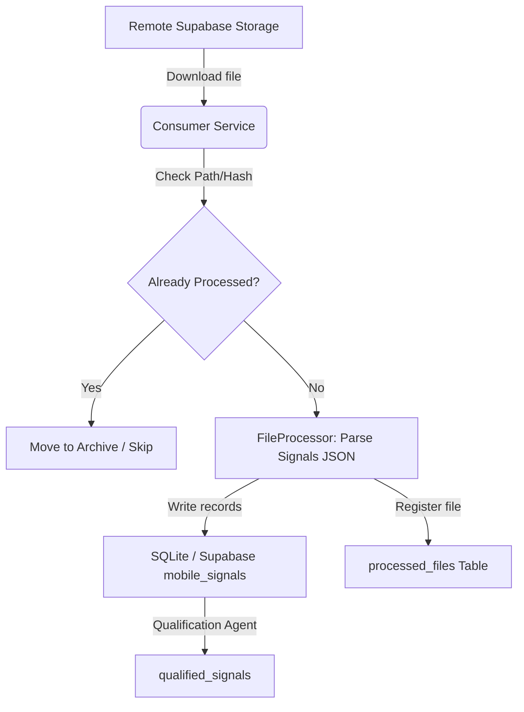

# Ingestion Inflow & File Tracking Audit Report

**Date:** 2026-06-28  
**Component:** Ingestion Framework Audit  

---

## 1. End-to-End Ingestion Flow

The pipeline ingests signal files through the following workflow:

---

## 2. Ingestion Source Support Status

| Source Type | Format | Status | Notes |
| :--- | :--- | :--- | :--- |
| **SMS** | JSON Signal List | **IMPLEMENTED** | Ingested via standard mobile backup JSON signal files. |
| **WhatsApp** | JSON Signal List | **IMPLEMENTED** | Ingested via standard mobile backup JSON signal files (source field set to `whatsapp`). |
| **Email** | N/A | **NOT IMPLEMENTED** | No parser or consumer exists. |
| **Excel** | N/A | **NOT IMPLEMENTED** | No Excel parsing capabilities. |
| **CSV** | N/A | **NOT IMPLEMENTED** | No CSV parsers exist. |
| **PDF** | N/A | **NOT IMPLEMENTED** | No PDF parsing capabilities. |
| **Manual** | N/A | **NOT IMPLEMENTED** | No manual entry/override forms exist. |

---

## 3. File Tracking Assessment

| Question | Answer | Details |
| :--- | :---: | :--- |
| **Q1: Can we identify which file was loaded?** | **YES** | Tracked via `file_name` and `file_path` in `processed_files`. |
| **Q2: Can we identify when it was loaded?** | **YES** | Tracked via `processed_timestamp` in `processed_files`. |
| **Q3: Can we identify how many records came from that file?** | **NO** | The `processed_files` schema does not store parsed or processed record counts. |
| **Q4: Can we identify how many records were rejected?** | **NO** | Rejected/failed count is not logged in the database registry. |
| **Q5: Can we identify whether the file was already processed?** | **YES** | Handled via hash-checking using `ProcessedFileRepository.exists_path_or_hash()`. |
| **Q6: Can we identify which records originated from that file?** | **NO** | Neither `signals` nor `mobile_signals` carries a foreign key link or batch ID mapping back to `processed_files`. Lineage is lost upon database write. |
