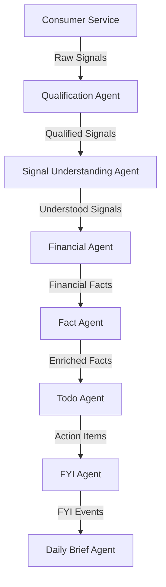

# Jarvis Runtime Flow Documentation

**Date:** 2026-06-28  
**Component:** Jarvis AI OS Architecture Reference  

---

## 1. Runtime Overview

The Jarvis runtime executes sequentially. A raw signal flows down the pipeline, transforming from unstructured text into qualified, semantic entities, financial facts, canonical memory representations, actions, alerts, and final summary briefs.



---

## 2. Stage-by-Stage Runtime Flow

### Consumer Service
* **Purpose:** Ingests raw data from external streams (Android SMS, notifications) and registers files.
* **Input Contract:** Raw SMS payloads, JSON notifications.
* **Output Contract:** Raw Signal Contract.
* **Owned Tables:** `signals`, `processed_files`, `mobile_signals`.
* **Read Dependencies:** External filesystem/API payloads.
* **Write Responsibilities:** Inserts incoming raw records to SQLite and Supabase replication tables.

### Signal Qualification Agent
* **Purpose:** Filters noise, system alerts, and duplicates from signals.
* **Input Contract:** Raw Signal Contract.
* **Output Contract:** Qualification Contract.
* **Owned Tables:** `qualified_signals`.
* **Read Dependencies:** `signals`, `mobile_signals`.
* **Write Responsibilities:** Inserts qualified signals matching utility rules.

### Signal Understanding Agent (SUA)
* **Purpose:** Performs entity extraction, semantic intent classification, and classifications mapping.
* **Input Contract:** Qualification Contract.
* **Output Contract:** Understanding Contract.
* **Owned Tables:** `understood_signals`.
* **Read Dependencies:** `qualified_signals`.
* **Write Responsibilities:** Inserts structured payload into `understood_signals`.

### Financial Agent
* **Purpose:** Resolves merchants, credit/debit events, salary occurrences, and aggregations.
* **Input Contract:** Understanding Contract.
* **Output Contract:** Financial Fact Contract.
* **Owned Tables:** `financial_facts`, `financial_events`, `transfer_pairs`, `salary_events`, `salary_sources`, `merchant_profiles`.
* **Read Dependencies:** `understood_signals`.
* **Write Responsibilities:** Updates transactions ledger and aggregates monthly stats.

### Fact Agent
* **Purpose:** Resolves canonical entities, handles graph edges/relationships, and manages confidence/conflict resolution.
* **Input Contract:** Understanding Contract, Financial Fact Contract.
* **Output Contract:** Fact Contract.
* **Owned Tables:** `facts`, `fact_relationships`.
* **Read Dependencies:** `understood_signals`, `financial_facts`.
* **Write Responsibilities:** Writes canonical facts and relation mappings.

### Todo Agent
* **Purpose:** Manages action items, prioritizes tasks, deduplicates alerts, and auto-completes bills via financial checks.
* **Input Contract:** Understanding Contract, Financial Fact Contract, Fact Contract.
* **Output Contract:** Todo Contract.
* **Owned Tables:** `todo_items`.
* **Read Dependencies:** `understood_signals`, `financial_facts`, `facts`.
* **Write Responsibilities:** Ingests and updates status of active tasks.

### FYI Agent
* **Purpose:** Ingests non-actionable notification logs (Salary deposits, travel confirmations, school notices).
* **Input Contract:** Understanding Contract, Fact Contract.
* **Output Contract:** FYI Contract.
* **Owned Tables:** `fyi_events`.
* **Read Dependencies:** `understood_signals`, `facts`.
* **Write Responsibilities:** Updates read-status of logs and merges duplicates.

### Daily Brief Agent
* **Purpose:** Compiles Morning and Evening briefs based on priority sorting without LLM dependencies.
* **Input Contract:** Todo Contract, FYI Contract, Fact Contract, Financial Fact Contract.
* **Output Contract:** Brief Contract.
* **Owned Tables:** `daily_briefs`.
* **Read Dependencies:** `todo_items`, `fyi_events`, `facts`, `financial_facts`.
* **Write Responsibilities:** Stores compiled Morning and Evening briefs.

---

## 3. Contract Flow Map

```
Raw Signal Contract ──> Qualification Contract ──> Understanding Contract
                                                        │
         ┌──────────────────────────────────────────────┴───────────────┐
         ▼                                                              ▼
Financial Fact Contract ──> Fact Contract ──> Todo Contract ──> FYI Contract
         │                     │                  │                 │
         └─────────────────────┴─────────┬────────┴─────────────────┘
                                         ▼
                                  Brief Contract
```

### Raw Signal Contract
* **Producer:** Consumer Service
* **Consumers:** Qualification Agent
* **Storage Location:** `signals` table

### Qualification Contract
* **Producer:** Qualification Agent
* **Consumers:** Understanding Agent
* **Storage Location:** `qualified_signals` table

### Understanding Contract
* **Producer:** Understanding Agent
* **Consumers:** Financial Agent, Fact Agent, Todo Agent, FYI Agent
* **Storage Location:** `understood_signals` table

### Financial Fact Contract
* **Producer:** Financial Agent
* **Consumers:** Fact Agent, Todo Agent, Daily Brief Agent
* **Storage Location:** `financial_facts` table

### Fact Contract
* **Producer:** Fact Agent
* **Consumers:** Todo Agent, FYI Agent, Daily Brief Agent
* **Storage Location:** `facts` table

### Todo Contract
* **Producer:** Todo Agent
* **Consumers:** Daily Brief Agent
* **Storage Location:** `todo_items` table

### FYI Contract
* **Producer:** FYI Agent
* **Consumers:** Daily Brief Agent
* **Storage Location:** `fyi_events` table

### Brief Contract
* **Producer:** Daily Brief Agent
* **Consumers:** Presentation Layer / Streamlit UI / Android View
* **Storage Location:** `daily_briefs` table

---

## 4. Database Ownership Map

Each table enforces the **Single Owner Principle** for write access. Other agents may query them freely via read-only interfaces.

| Table Name | Owning Agent | Read Consumers |
| :--- | :--- | :--- |
| `signals` | Consumer Service | Qualification Agent |
| `mobile_signals` | Consumer Service | Qualification Agent |
| `processed_files` | Consumer Service | None |
| `qualified_signals` | Qualification Agent | Signal Understanding Agent |
| `understood_signals` | Signal Understanding Agent | Financial Agent, Fact Agent, Todo Agent, FYI Agent |
| `financial_facts` | Financial Agent | Fact Agent, Todo Agent, Daily Brief Agent |
| `financial_events` | Financial Agent | None |
| `transfer_pairs` | Financial Agent | None |
| `salary_events` | Financial Agent | None |
| `salary_sources` | Financial Agent | None |
| `merchant_profiles` | Financial Agent | None |
| `facts` | Fact Agent | Todo Agent, FYI Agent, Daily Brief Agent |
| `fact_relationships` | Fact Agent | Todo Agent, FYI Agent, Daily Brief Agent |
| `todo_items` | Todo Agent | Daily Brief Agent |
| `fyi_events` | FYI Agent | Daily Brief Agent |
| `daily_briefs` | Daily Brief Agent | UI, Android Clients |

---

## 5. Runtime Execution Sequence

During a typical pipeline run inside `PipelineOrchestrator.run_pipeline()`:

1. **Step 1:** Ingestion sync parses files/payloads and stores them in `signals`.
2. **Step 2:** Qualification Agent filters noise and writes to `qualified_signals`.
3. **Step 3:** Understanding Agent processes semantic features and writes to `understood_signals`.
4. **Step 4:** Financial Agent processes transactions and records `financial_facts`.
5. **Step 5:** Fact Agent ingests profile contexts and registers long-term memory in `facts`.
6. **Step 6:** Todo Agent evaluates actions and records updates in `todo_items`.
7. **Step 7:** FYI Agent filters notifications and logs events in `fyi_events`.
8. **Step 8:** Daily Brief Agent aggregates records and compiles Morning/Evening templates inside `daily_briefs`.

---

## 6. Failure Isolation Rules

* **Single Writer Boundary:** Agents only write to their owned database tables. Cross-agent writes are strictly prohibited.
* **Downstream Enrichment:** Downstream agents enrich context by querying upstream facts, but never mutate the upstream contracts.
* **Immutable Output Contracts:** Once a pipeline contract is generated, it remains immutable to downstream consumers.
* **Supabase Replication Isolation:** Supabase connection or schema errors are caught and handled gracefully. The local SQLite database serves as the source of truth, allowing execution to continue uninterrupted.

---

## 7. Current Platform Status

```
Qualification Agent      LOCKED
Understanding Agent      LOCKED
Financial Agent          LOCKED
Fact Agent               LOCKED
Todo Agent               LOCKED
FYI Agent                LOCKED
Daily Brief Agent        LOCKED
```

**Platform Status:**  
`Core Intelligence Pipeline Complete`
