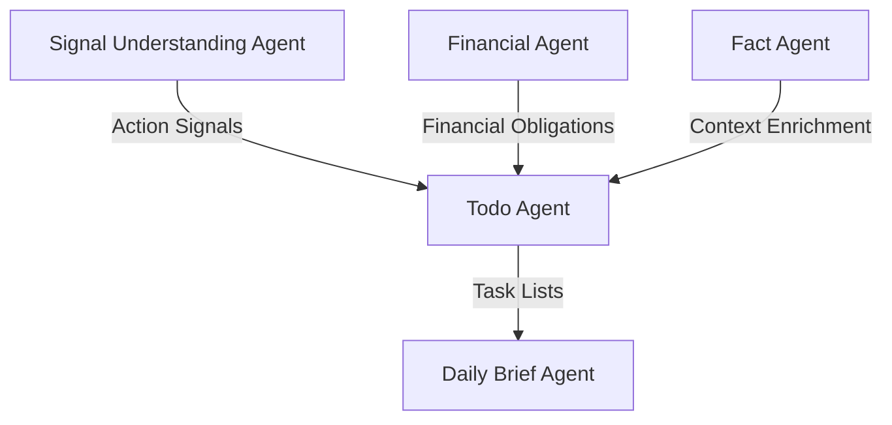
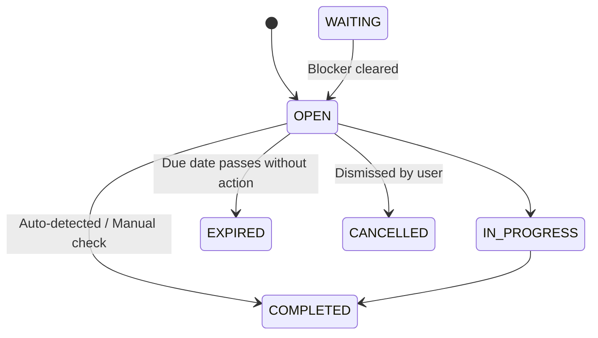

# Todo Agent Design Review

**Date:** 2026-06-28  
**Phase:** Module 6A - Todo Agent Design Review  
**Author:** Jarvis AI OS Architecture Group  

---

## 1. Executive Summary

The **Todo Agent** serves as the actionable execution layer of the Jarvis AI OS. While the Signal Understanding Agent classifies intent and the Fact Agent maintains long-term memory, the Todo Agent is solely responsible for determining **"What does the user need to do?"**

By ingesting qualified action-class signals and financial obligations, the Todo Agent compiles, prioritizes, deduplicates, and enriches tasks with long-term memory before presenting them to the user via the Daily Brief Agent. This design ensures that the user is presented with a clean, low-noise list of pending obligations with clear priorities and automated completion validation.

---

## 2. Todo Agent Architecture

The Todo Agent sits downstream of the understanding and memory layers, serving as a stateful task database.



### Internal Stage Sequencing
1. **Ingestion & Classification:** Receive candidates from SUA (e.g., appointment confirmations) or Financial Agent (e.g., bill alerts).
2. **Context Enrichment:** Query Fact Agent to map entities (e.g., adding license plate to a vehicle servicing task).
3. **Deduplication Engine:** Merge duplicate reminders for the same event.
4. **Priority Evaluation:** Compute urgency based on dates and financial impact.
5. **Persistence & Sync:** Save locally to SQLite and sync to Supabase.

---

## 3. Todo Contract

The canonical Todo schema will be defined as follows:

```python
# storage/models/todo_item.py

class TodoItem(Base):
    """
    Stateful action database representing user tasks and obligations.
    """
    __tablename__ = "todo_items"

    todo_id: Mapped[str] = mapped_column(String(36), primary_key=True)
    title: Mapped[str] = mapped_column(String(200), nullable=False)
    description: Mapped[str | None] = mapped_column(Text, nullable=True)
    
    # Taxonomy categorization
    category: Mapped[str] = mapped_column(
        String(30), nullable=False, index=True,
        comment="FINANCIAL | MEDICAL | EDUCATION | TRAVEL | HOUSEHOLD | WORK | SUBSCRIPTION | INSURANCE | VEHICLE | GENERAL"
    )
    
    # Priority & Status
    priority: Mapped[str] = mapped_column(String(20), nullable=False, default="MEDIUM")
    status: Mapped[str] = mapped_column(String(30), nullable=False, default="OPEN")
    
    # Temporal constraints
    due_date: Mapped[datetime | None] = mapped_column(DateTime, nullable=True)
    
    # Traceability
    source_agent: Mapped[str] = mapped_column(String(50), nullable=False)
    source_reference: Mapped[dict | None] = mapped_column(
        JSON, nullable=True,
        comment="Lineage details (e.g. {'signal_id': '...', 'fact_id': '...'})"
    )
    
    confidence: Mapped[float] = mapped_column(Float, nullable=False, default=1.0)
    
    created_at: Mapped[datetime] = mapped_column(DateTime, default=datetime.utcnow)
    updated_at: Mapped[datetime] = mapped_column(DateTime, default=datetime.utcnow, onupdate=datetime.utcnow)
```

---

## 4. Taxonomy

The Todo Agent will support the following ten canonical task categories:

* **`FINANCIAL`:** Credit card dues, loan payments, bill alerts, tax deadlines.
* **`MEDICAL`:** Doctor appointments, medicine refills, lab tests.
* **`EDUCATION`:** School fee payments, parent-teacher meetings, project deadlines.
* **`TRAVEL`:** Flight check-ins, hotel reservations, train boardings.
* **`HOUSEHOLD`:** Utility payments (electricity, gas, water), maintenance tasks.
* **`WORK`:** Work-related milestones or professional commitments.
* **`SUBSCRIPTION`:** Subscription renewals, cancellations, trials.
* **`INSURANCE`:** Policy renewals, premium payments.
* **`VEHICLE`:** Servicing dates, emission tests, toll refills.
* **`GENERAL`:** Miscellaneous personal tasks.

---

## 5. Priority Model

Tasks are assigned dynamic priorities: `CRITICAL`, `HIGH`, `MEDIUM`, or `LOW`.

### Scoring Rules

1. **Due Date Proximity:**
   * Due in `< 24 hours` → Automatic upgrade to `CRITICAL`.
   * Due in `< 72 hours` → Automatic upgrade to `HIGH`.
2. **Financial/Risk Impact:**
   * Failed SIPs, late loan/EMI dues, or insurance policy expiries are automatically classified as `CRITICAL` or `HIGH` regardless of time window due to high risk.
3. **Repeated Reminders:**
   * If the system detects a second independent signal reminding the user of the same task, the priority escalates (e.g., from `MEDIUM` to `HIGH`).
4. **User Override:**
   * The user can manually pin or adjust priorities which sets a `MANUAL_LOCK` on the priority field.

---

## 6. Lifecycle Model

Tasks transition through the following states:

* **`OPEN`:** The task is active and requires user action.
* **`IN_PROGRESS`:** The user has started acting on it.
* **`WAITING`:** Blocked on external confirmation (e.g. waiting for refund approval).
* **`COMPLETED`:** Task is successfully done (either marked manually or detected automatically).
* **`CANCELLED`:** Marked as no longer needed by user or agent.
* **`EXPIRED`:** Due date has passed without completion (flags as overdue alert).



---

## 7. Deduplication Strategy

To prevent spamming the user's list (e.g. receiving an SMS, WhatsApp message, and email for the same doctor appointment), the Todo Agent applies deduplication:

* **Identifier Matching:** If two tasks share the same category and close due dates (within a 6-hour window), they are compared.
* **Semantic Match:** The titles/descriptions are checked for matching entities (e.g., "Dr. Sen" or "HDFC Card").
* **Resolution:** The existing `todo_item` is updated with a merged description and new source reference lineage. No new todo is created.

---

## 8. Completion Strategy

Tasks can be completed in two ways:

1. **Manual Completion:** The user checks off the task in the Streamlit UI or Android Dashboard.
2. **Automatic Completion (Auto-Close):**
   * **Financial Tasks:** The Financial Agent publishes a new payment fact (e.g., `FinancialFact` debit of ₹5,200 to "Acko"). The Todo Agent scans for open `INSURANCE` tasks for "Acko" and automatically closes them.
   * **Travel/Appointment Tasks:** Passage of time can auto-close travel bookings once the departure date passes, transitioning them to `COMPLETED` or `EXPIRED`.

---

## 9. Storage Design

* **SQLite Tables:** A local `todo_items` table is created to store the runtime todo states.
* **Supabase Synchronization:** Writes are mirrored to Supabase `todo_items` in real-time, allowing the Streamlit UI and Android clients to fetch live task lists.
* **Audit History:** Todo status changes are written to the `runtime_events` or a lightweight `todo_history` table to track task durations.

---

## 10. Integration Design

* **Signal Understanding Agent (SUA):** Submits candidate tasks when `classes` contains `ACTION`.
* **Financial Agent:** Submits candidate tasks for credit card statements, failed payments, or loan obligations.
* **Fact Agent (Enrichment):** When a raw task is ingested (e.g. *"Renew car insurance"*), the Todo Agent queries the Fact Agent for `VEHICLE` and `INSURANCE_POLICY` facts. It updates the title to: *"Renew Swift insurance policy (Acko POL-9876)"* using memory context.
* **Daily Brief Agent:** Formats tasks into groups: *Today's Critical Tasks*, *Overdue*, and *Upcoming this week*.

---

## 11. Risks

1. **False Positive Auto-Completion:**
   * *Risk:* The agent might auto-complete a task based on an unrelated transaction of the same amount.
   * *Mitigation:* Ensure strict entity mapping (e.g., matching the merchant canonical name AND amount within a narrow time window before auto-closing).
2. **Alert Fatigue:**
   * *Risk:* If deduplication fails, the user will see multiple identical tasks.
   * *Mitigation:* Keep deduplication filters conservative and err on merging similar tasks within the same day.

---

## 12. Recommendations

1. **Leverage the Fact Agent for Context:** Ensure every task queries the `facts` store during the ingestion phase to replace generic descriptions with personalized data.
2. **Expose Clear Auto-Close Indicators:** In the UI, show a badge (e.g. *"Auto-completed via payment on 12-Jun"*) to build user trust.

---

READY FOR IMPLEMENTATION
