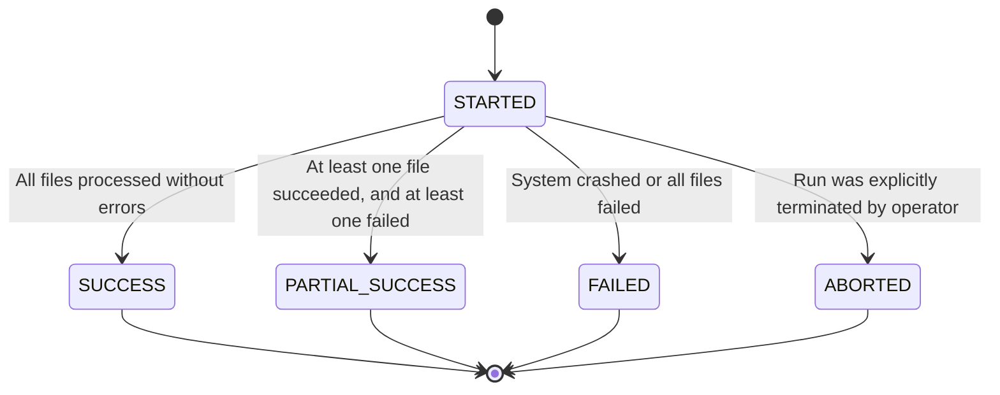

# Phase 1A Pipeline Lifecycle — PIPELINE_RUNS & EVENTS

This document details the states, triggers, lifecycle phases, and audit trail events recorded during the execution of the Jarvis V2 ingestion pipeline.

---

## 1. Allowed Status Values

A pipeline execution starts in the `STARTED` status and must terminate in one of the following four final states:

* **STARTED:** The orchestrator has generated a `run_id` and logged the startup parameters.
* **SUCCESS:** The pipeline completed its entire execution block. All discovered files were successfully processed (or skipped due to duplication) and archived.
* **PARTIAL_SUCCESS:** The run completed, but one or more files failed parsing or encountered transient errors while other files were successfully processed.
* **FAILED:** The run encountered a critical system exception (e.g. database connection down, credentials invalid) or all discovered files failed processing.
* **ABORTED:** Reserved for execution workflows interrupted by command signals or termination hooks.

---

## 2. Trigger Types

The orchestration CLI requires specifying the trigger context:

* **MANUAL:** Run was kicked off by an operator via command line.
* **SCHEDULED:** Run was triggered by a cron scheduler or Windows Task Scheduler.
* **RETRY:** Triggered to re-execute a failed file batch or run.
* **RECOVERY:** Triggered to handle files caught in intermediate states or to reconcile storage.

---

## 3. Detailed Event Log Catalog

For every pipeline run, detailed logs are recorded to `pipeline_run_events` with one of the following severity levels:
* `INFO`
* `WARNING`
* `ERROR`
* `CRITICAL`

### Event Types

The following table documents standard events emitted by the `ConsumerAgent`:

| Event Type | Severity | Description | Metadata Content |
|---|---|---|---|
| `RUN_STARTED` | `INFO` | Emitted when `start_run` succeeds. | `{}` |
| `FILES_DISCOVERED` | `INFO` | Emitted after storage bucket polling lists files. | `{"files": ["file1.json", ...]}` |
| `FILE_DISCOVERED` | `INFO` | Emitted when beginning to download/process a file. | `{"file_path": "incoming/file.json"}` |
| `DUPLICATE_FILE` | `INFO` | Emitted when a file is skipped due to SHA-256 match. | `{"file_name": "file.json", "file_hash": "..."}` |
| `FILE_PARSE_FAILED`| `ERROR` | Emitted when JSON validation or parsing throws an error. | `{"error": "JSONDecodeError", "file_name": "..."}` |
| `DUPLICATE_SIGNAL` | `WARNING`| Emitted when a signal is skipped due to unique message hash match. | `{"message_hash": "...", "sender": "..."}` |
| `FILE_ARCHIVED` | `INFO` | Emitted when a file is successfully logged and archived. | `{"file_hash": "...", "file_name": "..."}` |
| `RUN_COMPLETED` | `INFO` | Emitted when a run finishes (success/partial success). | Full run metrics (counts, status, duration) |
| `RUN_FAILED` | `CRITICAL`| Emitted when a run crashes or fails globally. | `{"error": "connection timeout"}` |

---

## 4. Run Metadata Extensibility

The `metadata` field (JSONB) on the `pipeline_runs` table is designed to capture runtime environments to debug environment issues. This includes:
* Python version
* CLI arguments
* Operating system details
* IP Addresses or system settings
