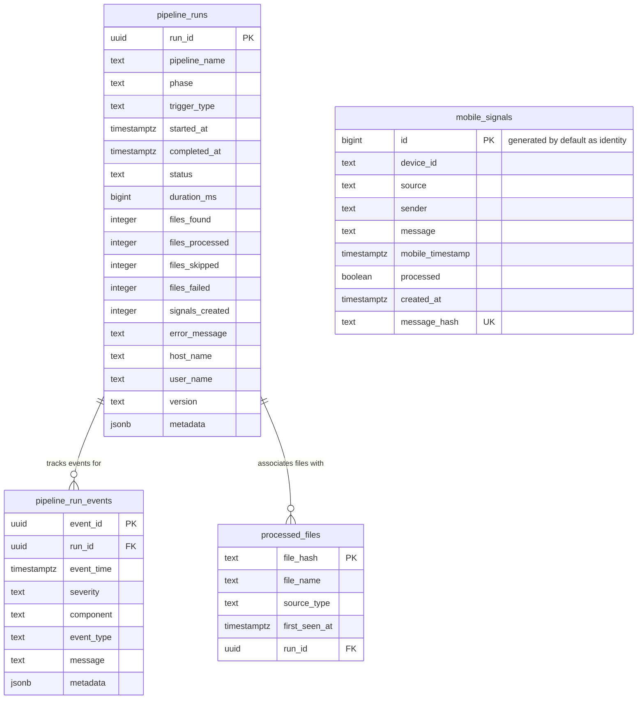

# Phase 1A Schema Specification — Consumption Infrastructure

This document defines the schema DDL, constraints, indexes, and column-level definitions implemented for the Jarvis V2 Consumption Infrastructure.

All tables reside in the Supabase schema:
```text
jarvis_insights_schemav1
```

---

## 1. Database Schema Diagram (Logical)



---

## 2. Table DDL & Column Specs

### Table: `pipeline_runs`

Holds the operational records for each run of the ingestion pipeline.

| Column | Data Type | Nullability | Description |
|---|---|---|---|
| `run_id` | `uuid` | `NOT NULL` | Primary key identifying the execution. |
| `pipeline_name` | `text` | `NOT NULL` | Name of the pipeline (e.g., `consumer_sync`). |
| `phase` | `text` | `NOT NULL` | Phase name (e.g., `phase1a`). |
| `trigger_type` | `text` | `NOT NULL` | Trigger type: `MANUAL`, `SCHEDULED`, `RETRY`, `RECOVERY`. |
| `started_at` | `timestamptz`| `NOT NULL` | Timestamp when the pipeline execution started. |
| `completed_at` | `timestamptz`| `NULL` | Timestamp when the pipeline execution ended. |
| `status` | `text` | `NOT NULL` | Run status: `STARTED`, `SUCCESS`, `PARTIAL_SUCCESS`, `FAILED`, `ABORTED`. |
| `duration_ms` | `bigint` | `NULL` | Run duration in milliseconds. |
| `files_found` | `integer` | `DEFAULT 0` | Total file count discovered in the storage folder. |
| `files_processed`| `integer` | `DEFAULT 0` | Count of successfully processed and archived files. |
| `files_skipped` | `integer` | `DEFAULT 0` | Count of duplicate files skipped based on SHA-256 hash. |
| `files_failed` | `integer` | `DEFAULT 0` | Count of files that failed parsing or processing. |
| `signals_created`| `integer` | `DEFAULT 0` | Count of raw signals created/inserted. |
| `error_message` | `text` | `NULL` | Crash exception message if status is FAILED. |
| `host_name` | `text` | `NULL` | Host name of the machine executing the code. |
| `user_name` | `text` | `NULL` | User name running the pipeline script. |
| `version` | `text` | `NULL` | Release version of the code (e.g., `v2.0.0-phase1a`). |
| `metadata` | `jsonb` | `NULL` | Extensible json block for miscellaneous attributes. |

---

### Table: `pipeline_run_events`

Detailed audit logs recorded during pipeline execution.

| Column | Data Type | Nullability | Description |
|---|---|---|---|
| `event_id` | `uuid` | `NOT NULL` | Primary key of the event. |
| `run_id` | `uuid` | `NOT NULL` | Foreign key referencing `pipeline_runs.run_id`. |
| `event_time` | `timestamptz`| `NOT NULL` | Timestamp of the event. |
| `severity` | `text` | `NOT NULL` | Severity: `INFO`, `WARNING`, `ERROR`, `CRITICAL`. |
| `component` | `text` | `NOT NULL` | Component that raised the event (e.g., `consumer_agent`). |
| `event_type` | `text` | `NOT NULL` | Action/event type (e.g., `RUN_STARTED`, `FILE_DISCOVERED`, `DUPLICATE_FILE`). |
| `message` | `text` | `NULL` | Descriptive message for humans. |
| `metadata` | `jsonb` | `NULL` | Contextual logging attributes. |

---

### Table: `processed_files`

The idempotency ledger checking files that have been parsed.

| Column | Data Type | Nullability | Description |
|---|---|---|---|
| `file_hash` | `text` | `NOT NULL` | Primary key: SHA-256 hash of the file contents. |
| `file_name` | `text` | `NOT NULL` | Name of the file when processed. |
| `source_type` | `text` | `NOT NULL` | Source extracted from the file content (e.g. `sms`, `whatsapp`). |
| `first_seen_at` | `timestamptz`| `NOT NULL` | Timestamp when first recorded. |
| `run_id` | `uuid` | `NOT NULL` | Foreign key referencing `pipeline_runs.run_id` that processed it. |

---

### Table: `mobile_signals`

Raw ingested signals extracted from JSON uploads.

| Column | Data Type | Nullability | Description |
|---|---|---|---|
| `id` | `bigint` | `NOT NULL` | Auto-incrementing primary key. |
| `device_id` | `text` | `NOT NULL` | Device source identifier (e.g. `user_phone`). |
| `source` | `text` | `NOT NULL` | Ingestion source (e.g. `sms`, `whatsapp`). |
| `sender` | `text` | `NOT NULL` | Phone number or name of the sender. |
| `message` | `text` | `NOT NULL` | Raw content of the message. |
| `mobile_timestamp`| `timestamptz`| `NOT NULL`| Ingestion-ready timestamp generated by the device. |
| `processed` | `boolean` | `DEFAULT false`| If this signal was processed downstream. |
| `created_at` | `timestamptz`| `DEFAULT now()`| Database insert timestamp. |
| `message_hash` | `text` | `NULL` | Unique SHA-256 hash of the message contents. |

---

## 3. SQL DDL Statements

```sql
-- 1. Create pipeline_runs table
create table jarvis_insights_schemav1.pipeline_runs
(
    run_id uuid primary key,
    pipeline_name text not null,
    phase text not null,
    trigger_type text not null,
    started_at timestamptz not null,
    completed_at timestamptz,
    status text not null,
    duration_ms bigint,
    files_found integer default 0,
    files_processed integer default 0,
    files_skipped integer default 0,
    files_failed integer default 0,
    signals_created integer default 0,
    error_message text,
    host_name text,
    user_name text,
    version text,
    metadata jsonb
);

-- 2. Create pipeline_run_events table
create table jarvis_insights_schemav1.pipeline_run_events
(
    event_id uuid primary key,
    run_id uuid not null,
    event_time timestamptz not null,
    severity text not null,
    component text not null,
    event_type text not null,
    message text,
    metadata jsonb,
    constraint fk_pipeline_run_events_run_id
        foreign key (run_id)
        references jarvis_insights_schemav1.pipeline_runs(run_id)
        on delete cascade
);

-- 3. Create processed_files table
create table jarvis_insights_schemav1.processed_files
(
    file_hash text primary key,
    file_name text not null,
    source_type text not null,
    first_seen_at timestamptz not null,
    run_id uuid not null,
    constraint fk_processed_files_run_id
        foreign key (run_id)
        references jarvis_insights_schemav1.pipeline_runs(run_id)
        on delete cascade
);

-- 4. Create mobile_signals table
create table jarvis_insights_schemav1.mobile_signals
(
    id bigint generated by default as identity primary key,
    device_id text not null,
    source text not null,
    sender text not null,
    message text not null,
    mobile_timestamp timestamptz not null,
    processed boolean default false,
    created_at timestamptz default now(),
    message_hash text unique
);

-- Indexes for performance and query optimization
create index idx_pipeline_run_events_run_id on jarvis_insights_schemav1.pipeline_run_events(run_id);
create index idx_processed_files_run_id on jarvis_insights_schemav1.processed_files(run_id);
```
