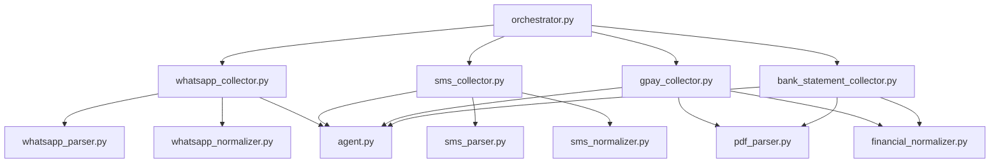

# Phase 1B Architecture Document — Source Collectors

This document defines the modular architecture, component relationships, and data dependencies of the Jarvis V2 Source Collectors.

---

## 1. Directory Structure Layout

The Phase 1B implementation is structured inside `src/agents/consumer/` alongside the Phase 1A baseline:

```text
src/agents/consumer/
├── agent.py                 # Core agent (Supabase wrapper)
├── orchestrator.py          # Orchestration pipeline execution
│
├── collectors/              # Subdirectory polling & ingestion
│   ├── whatsapp_collector.py
│   ├── sms_collector.py
│   ├── gpay_collector.py
│   └── bank_statement_collector.py
│
├── parsers/                 # Parsing validation and text extraction
│   ├── whatsapp_parser.py
│   ├── sms_parser.py
│   └── pdf_parser.py        # Reusable PDF extractor (using pypdf)
│
└── normalizers/             # Standardizing to Unified Signal Schema
    ├── whatsapp_normalizer.py
    ├── sms_normalizer.py
    └── financial_normalizer.py
```

---

## 2. Component Dependency Relationships



* **Orchestrator (`orchestrator.py`):** Acts as the entrypoint pipeline. Instantiates the client and triggers all collectors.
* **Collectors (`collectors/`):** Own subdirectory discovery, downloading, parser/normalizer delegation, database insertion, archiving, and error catching.
* **Parsers (`parsers/`):** Read raw files (JSON formats or PDF bytes via `pdf_parser.py`) and perform DTD/schema validation.
* **Normalizers (`normalizers/`):** Translate the parsed structures into the Unified Signal Schema dictionary representation.
* **Agent (`agent.py`):** Provides the direct Supabase API interface for inserts, updates, file moves, and logging.
