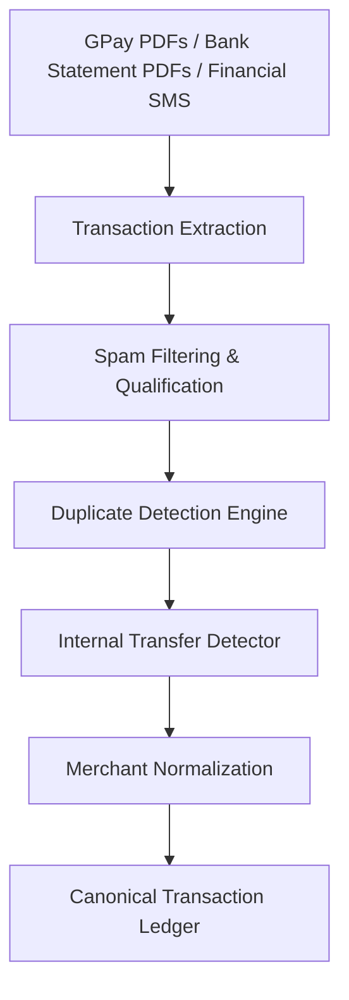

# Financial Agent Phase 1: Ledger Foundation Plan

## 1. Objective & Scope
The sole goal of **Financial Agent Phase 1** is to construct a **Trusted Transaction Ledger**. It is strictly a backend and data integrity milestone. It will capture, normalize, deduplicate, reconcile, and store transactions with high accuracy. 

It explicitly excludes all downstream features (such as spend analytics, budget checking, category dashboards, monthly brief aggregates, and AI financial advice), which are deferred to **Phase 2**.

---

## 2. Landscape Review: What to Reuse vs. Change

Based on the Phase-0 findings, we audit existing codebase components to define our baseline strategy:

### A. What Can Be Reused
- **PDF Extraction Engine**: The `pypdf` text parsing structure inside [pdf_parser.py](file:///home/user/petprojects/ai/jarvis/src/agents/consumer/parsers/pdf_parser.py) is sound and will be reused.
- **Deterministic Regex Extractors**: The date and token regex patterns inside [gpay_collector.py](file:///home/user/petprojects/ai/jarvis/src/agents/consumer/collectors/gpay_collector.py) are highly accurate for GPay statement parsing and will be reused.
- **Orchestrator Logs & Events**: The event logging system (`log_event`) inside [orchestrator.py](file:///home/user/petprojects/ai/jarvis/src/agents/consumer/orchestrator.py) will continue to track execution metrics.

### B. What Must Change
- **SBI Statement Index Scan**: [bank_statement_collector.py](file:///home/user/petprojects/ai/jarvis/src/agents/consumer/collectors/bank_statement_collector.py) must be patched with a `break` statement when the first page's `Contact_7nce` header is matched. This fixes the multi-page parsing bug that drops the first few pages of transactions.
- **Financial SMS Classifier**: The current router / classifier must be upgraded. Marketing spam containing financial offers (Lifetime Free Cards, loan limits) must be filtered out before entering the financial pipeline, resolving the 75% spam leakage rate.
- **Extraction Schema**: The output contracts must move away from generic string mappings and utilize our new structured canonical transaction model.

### C. New Components Required
- **Spam Filtering Layer**: A deterministic regex and value guard to drop non-transactional messages.
- **Deduplication Engine**: A component that cross-references SMS real-time alerts against periodic GPay and Bank Statement PDFs.
- **Internal Transfer Resolver**: A reconciliation module that groups offsetting bank transfers (HDFC ↔ SBI) and marks them as `TRANSFER` type.
- **Merchant Normalization Lookup & Retrofit DB**: Tables and logic for local fuzzy-matching of merchants (deterministic stage) and recording manual overrides (retrofit stage).

---

## 3. Phase 1 End-to-End Pipeline Architecture

The ingestion and ledger normalization flow follows a strictly sequential, non-cyclical pipeline:

### Stage-by-Stage Breakdown:
1. **Transaction Extraction**:
   - Parses incoming text/raw files into raw transaction dictionaries. 
   - Uses strict regex parsers for PDF statements and SMS alerts.
2. **Spam Filtering & Qualification**:
   - Evaluates parsed signals.
   - Drops alerts representing credit card limit offers, eligibility reminders, or marketing text. Only allows messages with clear financial event types (`DEBIT` or `CREDIT`).
3. **Duplicate Detection Engine**:
   - Cross-references real-time feed transactions (SMS) with batch statements (GPay/SBI).
   - Groups duplicate signals and flags them as `TRUE_DUPLICATE` or `PARTIAL_DUPLICATE`, writing only unique transactions to the ledger.
4. **Internal Transfer Detector**:
   - Flags transactions representing money moving between user-owned accounts (e.g. HDFC ↔ SBI) based on counterparty names and matching credit/debit records.
5. **Merchant Normalization**:
   - Normalizes raw merchant strings (e.g., `SWIGGY*` -> `Swiggy`) using a local synonym mapping, falling back to a first-pass LLM recommendation.
6. **Canonical Transaction Ledger**:
   - Persists the cleaned, structured records in a new `financial_ledger` database table.
