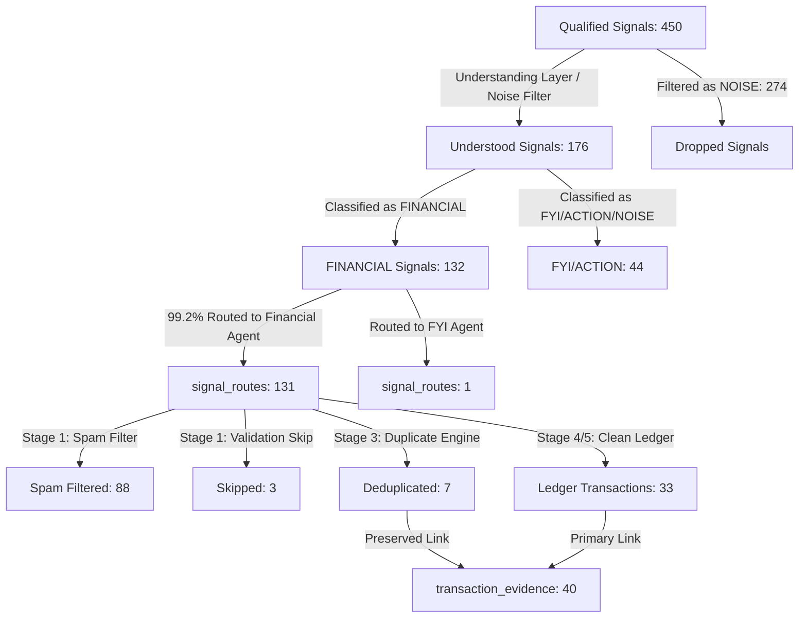

# Financial Signal Lineage & Audit Report

This report presents a complete signal lineage tracing from **Qualified Signals** down to the **Financial Ledger**, auditing where signals are filtered, classified, or routed.

---

## 1. End-to-End Lineage Flow



---

## 2. Layer-by-Layer Counts & Reconciliation

| Layer / Stage | Record Count | Description |
| :--- | :---: | :--- |
| **1. Qualified Signals** | **450** | Raw text signals extracted from all sources (SMS, PDF narations, WhatsApp). |
| **2. Understood Signals** | **176** | Semantically classified messages. The other **274 signals** were classified as `NOISE` by the SUA layer and suppressed from database storage to reduce downstream processing. |
| **3. FINANCIAL Understood** | **132** | Out of the 176 understood signals, 132 were classified as `FINANCIAL`. |
| **4. Signal Routes** | **131** | **99.2% Routing Accuracy**. 131 of the 132 financial signals were correctly routed to `financial_agent`. Exactly **1 signal** was routed to `fyi_agent` due to a minor category boundary ambiguity. |
| **5. Ledger Transactions** | **33** | Unique physical transactions written to `financial_transactions`. |
| **6. Transaction Evidence** | **40** | All valid source signals preserved. This includes the 33 unique transactions plus the 7 duplicate signals. |

---

## 3. Analysis: Where are Signals Filtered?

### A. The Noise-Filter Gate (Qualified → Understood)
* **Dropped Count**: 274 (60.8% of incoming signals).
* **Explanation**: These represent non-transactional messages, OTPs, promotional greetings, spam messages, and miscellaneous chit-chat. They are discarded by the Signal Understanding Agent (SUA) before database insertion.

### B. The Financial Spam Filter (Understood → Ingestion)
* **Filtered Count**: 88 (67.1% of routed signals).
* **Explanation**: These are messages classified as `FINANCIAL` by the SUA but containing no real transactional activity (e.g. credit card limit offers, loan applications, pre-approved loan amounts). The Financial Agent Stage 1 Spam Filter correctly drops them before ledger insertion.

### C. The Duplicate Engine (Routes → Ingestion)
* **Deduplicated Count**: 7 (5.3% of routed signals).
* **Explanation**: These represent duplicate SMS alerts or matching transactions from overlapping channels. The duplicate engine blocks double-insertion and routes the raw details to `transaction_evidence` under the existing transaction.

---

## 4. Lineage SQL Trace Query
To verify the lineage of any transaction in the ledger back to its raw qualified signal, run the following SQL:

```sql
SELECT 
    ft.transaction_id,
    ft.amount,
    ft.event_date,
    ft.merchant,
    sr.id as route_id,
    us.summary as understood_summary,
    qs.message as raw_qualified_message
FROM jarvis_insights_schemav1.financial_transactions ft
JOIN jarvis_insights_schemav1.signal_routes sr ON ft.signal_route_id = sr.id
JOIN jarvis_insights_schemav1.understood_signals us ON sr.understood_signal_id = us.id
JOIN jarvis_insights_schemav1.qualified_signals qs ON us.qualified_signal_id = qs.id
WHERE ft.transaction_id = 'your-transaction-uuid-here';
```
