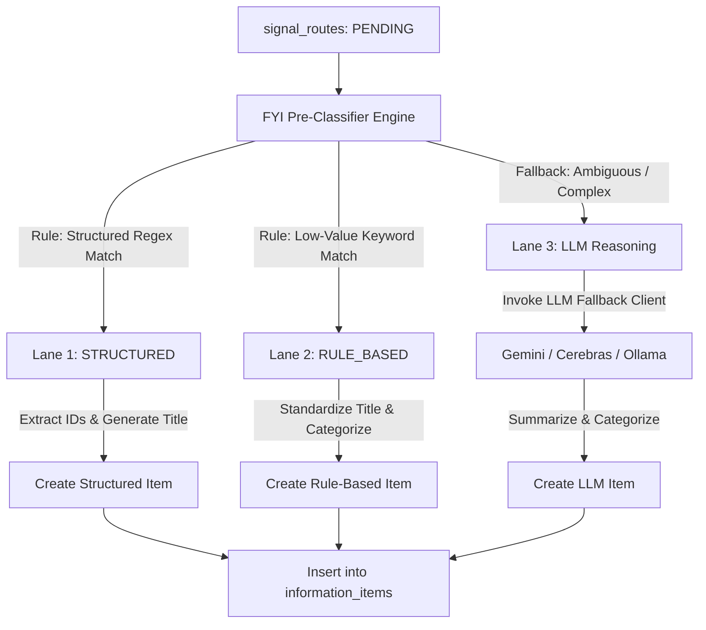

# FYI Agent V1: Architectural Blueprint (Revised)

This document outlines the revised design and specifications for **FYI Agent V1**. It implements a **three-lane processing architecture** that preserves 100% of informational signals while routing at least 70–80% of low-complexity or structured payloads through deterministic paths, reserving the LLM only for high-value ambiguous context.

---

## 1. Design Philosophy

Unlike the To-Do Agent (which creates actionable tasks) or the Financial Agent (which registers transactions), the FYI Agent operates on the principle of **contextual awareness and zero-action preservation**.

### Core Tenets:
1. **Preserve Information at all Costs**: Ambiguous or low-value context is stored deterministically. Nothing is lost.
2. **Cost-Performance Efficiency (Three-Lane Processing)**: Bypasses the LLM for structured and generic updates to minimize API costs and latency.
3. **Deterministic Timelines**: Uses regex/code-based extractors to generate identical `timeline_group_id` keys, preventing model divergence.
4. **Auditability**: Includes an explicit `processing_path` to track and measure the efficiency of rule-based vs. LLM-based processing.

---

## 2. Three-Lane Routing Architecture

Every incoming signal routed to `fyi_agent` undergoes pre-classification to determine the cheapest and most reliable processing path:



### Lane 1: Structured Information (No LLM)
* **Goal**: Process notifications containing machine-parsable tracking details, codes, or IDs.
* **Examples**: Order confirmations, dispatch alerts, locker operations, train departure/arrival notices.
* **Action**: Code-based regex extractors pull entities (e.g. order numbers, PNRs) and format clean titles deterministically.
* **Processing Path**: `STRUCTURED`

### Lane 2: Known Low-Value FYI (No LLM)
* **Goal**: Preserve generic informational noise without waste.
* **Examples**: Network maintenance notices, generic survey/feedback requests, routine system updates.
* **Action**: Categorized under `GENERAL` with standard titles (e.g. `"System Maintenance Notice"`) without invoking Gemini.
* **Processing Path**: `RULE_BASED`

### Lane 3: Ambiguous Human-Relevant Information (LLM)
* **Goal**: Synthesize complex communications requiring semantic understanding and reasoning.
* **Examples**: School homework, medical/clinic updates, discussions with family, legal/insurance documents, tenant discussions.
* **Action**: Routed to the Gemini-first fallback client to generate custom titles, summaries, and categories.
* **Processing Path**: `LLM_GEMINI` / `LLM_CEREBRAS` / `LLM_LOCAL`

---

## 3. Data Model Design

### 3.1 Proposed `information_items` Table Schema

```sql
CREATE TYPE jarvis_insights_schemav1.fyi_processing_path AS ENUM (
    'STRUCTURED',
    'RULE_BASED',
    'LLM_GEMINI',
    'LLM_CEREBRAS',
    'LLM_LOCAL'
);

CREATE TABLE jarvis_insights_schemav1.information_items (
    id UUID PRIMARY KEY DEFAULT gen_random_uuid(),
    
    -- Lineage
    route_id UUID REFERENCES jarvis_insights_schemav1.signal_routes(id) ON DELETE SET NULL,
    
    -- Routing Audit
    processing_path jarvis_insights_schemav1.fyi_processing_path NOT NULL,
    
    -- Categorization & Presentation
    category VARCHAR(50) NOT NULL CHECK (
        category IN ('TRAVEL', 'ORDER_TRACKING', 'SECURITY_ALERT', 'FAMILY_SCHOOL', 'UTILITY_INFO', 'GENERAL')
    ),
    title VARCHAR(255) NOT NULL,
    summary TEXT NOT NULL,
    
    -- Payload Preservation
    raw_payload JSONB NOT NULL, -- Stores sender, original timestamp, raw message, and metadata
    
    -- Deterministic Timeline Metadata
    event_datetime TIMESTAMP WITH TIME ZONE NULL, -- Extracted time of event (independent of SMS arrival)
    timeline_group_id VARCHAR(100) NULL,          -- Deterministic, code-generated group slug
    
    -- Audit Timestamps
    created_at TIMESTAMP WITH TIME ZONE DEFAULT timezone('utc'::text, now()) NOT NULL,
    updated_at TIMESTAMP WITH TIME ZONE DEFAULT timezone('utc'::text, now()) NOT NULL
);

-- Indexes for rapid timeline collation and daily briefs
CREATE INDEX idx_info_items_timeline ON jarvis_insights_schemav1.information_items(timeline_group_id, event_datetime ASC);
CREATE INDEX idx_info_items_path ON jarvis_insights_schemav1.information_items(processing_path);
CREATE INDEX idx_info_items_created ON jarvis_insights_schemav1.information_items(created_at DESC);
```

---

## 4. Deterministic Timeline Grouping & Parser Rules

To ensure consistency and avoid LLM hallucinations, `timeline_group_id` keys are generated in code using deterministic patterns:

| Pattern Type | Input Signal Hint | Regex/Logic | Generated `timeline_group_id` |
|---|---|---|---|
| **Orders** | `order 391307 shipped`, `Tru Hair #391307` | `order[#\s-]*(?P<num>\d+)` | `order-391307` |
| **Travel (Rail)** | `PNR-4941680424`, `Train booking details` | `pnr[-:\s]*(?P<num>\d+)` | `train-4941680424` |
| **Claims** | `processed claim 50597764`, `Claim #50597764` | `claim[-#\s]*(?P<num>\d+)` | `claim-50597764` |
| **Service Tickets** | `Service Request No.JS-260701100851586` | `(JS-\d+)` | `service-js-260701100851586` |
| **Locker Ops** | `Locker No SF02-00097 operated` | `locker\s*(no)?\s*(?P<num>\w+-\d+)` | `locker-sf02-00097` |

---

## 5. Briefing Presentation Strategy

The Morning Briefing generator queries the `information_items` table and formats the compiled bulletins:

### Presentation Flow:
1. **Collate Timelines**: Groups items sharing a `timeline_group_id` and prints them as a bulleted progression (e.g. Courier status changes over the last 48 hours).
2. **Alerts Priority**: Displays `SECURITY_ALERT` or high-value `FAMILY_SCHOOL` updates first.
3. **General Bullets**: Compiles `RULE_BASED` and `STRUCTURED` items into a concise ticker at the bottom, reserving premium layouts for ambiguous items resolved by the LLM.

### Sample Briefing Output:

```markdown
## 🌅 Good Morning, User!
Here is your Jarvis FYI Briefing for July 12, 2026:

### 🔒 Security Alerts
* **Locker Activity**: Locker `SF02-00097` was operated yesterday at 14:32. [Path: STRUCTURED]

### 📦 Order & Delivery Timelines
* **Tru Hair & Skin (Order #391307)**:
  * *Jun 21*: Order confirmed.
  * *Jun 23*: Package shipped via Delhivery (Tracking: 98356107389).
  * *Jun 24 (Latest)*: Out for delivery.

### 🚄 Travel & Transit
* **Train Status (PNR: 4941680424)**:
  * *18:23*: Boarded Train 12634 from NCJ.
  * *19:10 (Latest)*: Train has departed NCJ. Status: On Time.

### 🏫 Family & School
* **Times Kids Homework**: [REDACTED_NAME] uploaded homework instructions for Book 1: pg 9. [Path: LLM_GEMINI]
```
