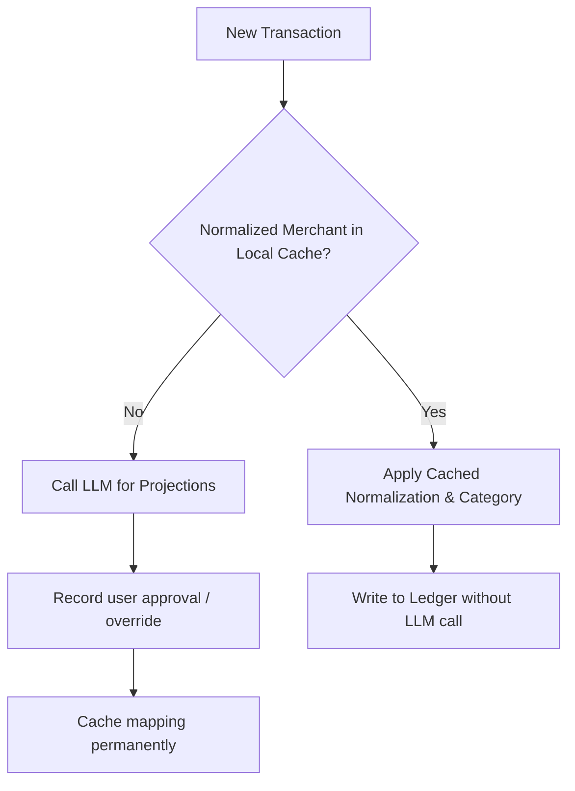

# Financial Ingestion: LLM Usage Strategy

## 1. LLM Requirements by Pipeline Stage

To optimize execution speed, eliminate hallucinations, and keep API costs minimal, Financial Phase 1 adopts a **strictly hybrid architecture**. Deterministic rules handle extraction, deduplication, and transfer grouping, while LLM execution is restricted to entity normalization and category recommendation.

---

## 2. Detailed Pipeline Matrix

| Pipeline Stage | LLM Required? | Rationale & Alternative Strategy |
| :--- | :---: | :--- |
| **Transaction Extraction** | **NO** | PDF structures (SBI/HDFC statements) and financial SMS formats are highly structured and are parsed via deterministic regex patterns (amount, reference, dates). |
| **Spam / Promotion Filtering** | **Mostly NO** | **95% of spam** can be filtered deterministically (e.g. dropping messages lacking keywords like `debited`, `credited`, `withdrawn`, `spent`, or containing keywords like `pre-approved`, `eligible`, `apply now`). An LLM is only utilized as an ambiguous case fallback when the deterministic confidence is below a set threshold. |
| **Duplicate Detection** | **NO** | Matching must be 100% deterministic based on unique keys (UPI Transaction IDs, reference numbers, or exact amount+timestamp tolerances). Using an LLM for deduplication risks high latencies and false-positive merges. |
| **Internal Transfer Detection** | **NO** | Transfers between user-owned accounts (HDFC ↔ SBI) are identified using deterministic double-entry offset rules and owner name keyword lists. |
| **Merchant Normalization** | **YES** | Raw strings (e.g. `SWIGGY*BANGALORE`) vary wildly. The LLM is used to propose a cleaned first-pass name (`Swiggy`), which is then cached. User approval is requested, and once approved, it is stored in a permanent deterministic lookup table to bypass the LLM in the future. |
| **Category Recommendation** | **YES** | Transactions are mapped to the financial taxonomy. The LLM analyzes the normalized merchant and narration text to propose one of the standard categories (e.g. Food, Travel). User override is supported, and user choices are permanently cached. |

---

## 3. Caching & Bypassing Strategy for High-Speed Processing

To ensure the system performs with sub-second latency and minimal LLM dependencies, we implement a **Learn-Once Bypass Pattern**:

By caching the mapping of `raw_merchant` ➔ `normalized_merchant` ➔ `category` locally, **every subsequent transaction for that merchant is processed deterministically without making an LLM API request**.
