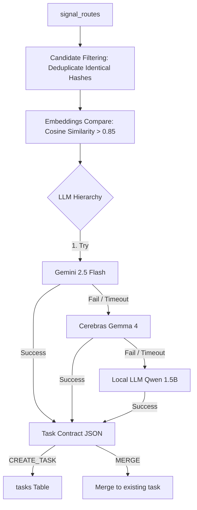

# To-Do Agent: LLM Strategy Refactor Plan

This document outlines the architectural refactor plan to upgrade the To-Do Agent's primary reasoning engine. Based on the validation findings, the local `qwen2.5:1.5b` model is no longer approved as the primary engine due to context leakage, high duplication rate, and poor rationalization. We propose a multi-tiered routing structure prioritised on Google Gemini and Cerebras.

---

## Section 1 - Current State

### Current Model Usage & Selection Logic
Currently, the To-Do Agent uses a single local model (`qwen2.5:1.5b`) for both reasoning and fallback operations:
* **Primary Model**: `qwen2.5:1.5b` via the local Ollama instance running on `http://localhost:11434`.
* **Selection Logic**: Hardcoded in the agent's initialization (`src/agents/todo/todo_agent.py`):
  ```python
  def __init__(self, provider: str = None, model: str = None):
      self.provider = provider or "local"
      self.model = model or "qwen2.5:1.5b"
      self.llm_client = LLMClient(provider=self.provider, model=self.model)
  ```
* **Fallback Logic**: If the local LLM call fails, times out, or its output is malformed, a deterministic fallback in Python is triggered. This fallback pulls fields straight from the canonical contract (e.g. `summary`, `due_date`) and creates a basic task without any advanced formatting or deduplication.

### Qwen Invocation Points
The local model is invoked at:
1. `src/agents/todo/todo_agent.py`: inside `process_pending_routes()` which loops over all pending signals and calls `_reason_over_task()`.
2. `intelligence/llm_client.py`: inside `_ask_local()`, which handles POST requests to the local Ollama API.

---

## Section 2 - Connectivity Validation

Validation was executed from the actual Jarvis runtime environment, loading secrets from `.env` without hardcoding:

* **Google Gemini Connectivity**:
  * **Model**: `gemini-2.5-flash` (via `v1beta` API version)
  * **Status**: **SUCCESS**
  * **Latency**: ~1.54s
  * **Response Quality**: High-fidelity, JSON-schema compliant.
* **Cerebras Cloud Connectivity**:
  * **Model**: `gemma-4-31b` (OpenAI-compatible completions endpoint)
  * **Status**: **SUCCESS**
  * **Latency**: **~0.35s (Highly performant)**
  * **Response Quality**: Fast, well-structured, OpenAI-compatible payload.

---

## Section 3 - Quality Comparison Summary

A head-to-head quality comparison was executed on 6 actual routed signals:

* **Task Decisions**: Gemini and Cerebras successfully identified duplicate signals and recommended merging them into existing tasks, providing the matching task UUIDs. Local Qwen failed entirely, recommending `CREATE_TASK` for 100% of signals and creating duplicates.
* **Rationalization & Formats**: Gemini and Cerebras turned messy input text into clean imperative task titles (e.g., `"Renew Vehicle Insurance Policy TN149509 Online"`). Qwen copied the raw text or fell victim to context leakage.
* **Hallucination & Context Leakage**: Qwen suffered from severe context leakage, repeating keywords like "purifier person" on unrelated medical or tenant shifting signals. Gemini and Cerebras maintained strict context boundaries.
* **Overall Rating**: Gemini (Grade A - Primary), Cerebras (Grade A- - Fallback), Local Qwen (Grade D - Last Resort).

For the full comparison table, refer to [TODO_AGENT_MODEL_COMPARISON.md](file:///home/user/petprojects/ai/jarvis/docs/TODO_AGENT_MODEL_COMPARISON.md).

---

## Section 4 - Production Recommendation

We recommend migrating to the following multi-tiered LLM hierarchy:

1. **Primary Model: Google Gemini (`gemini-2.5-flash`)**
   * *Justification*: Exhibits the highest compliance with complex JSON formatting and prompt constraints. It possesses a large context window capable of holding a substantial list of open tasks to support deduplication.
2. **Fallback Model: Cerebras Cloud (`gemma-4-31b` or equivalent)**
   * *Justification*: Blazing fast latency (sub-second completions). Excellent reasoning capabilities (e.g., correctly classifying medical messages as informational `IGNORE`). Acts as an ideal high-speed fallback when Gemini experiences 503 unavailable spikes.
3. **Last Resort: Local LLM (`qwen2.5:1.5b` or a larger local model like `qwen2.5:7b` if resources permit)**
   * *Justification*: Kept only for offline capability or total service outages. Since its task generation is poor and prone to duplication, it should only be used to ensure basic task generation continues when cloud networks are down.

---

## Section 5 - TODO Agent Refactor

### Refactored Data Flow

The target refactored pipeline adds **candidate pre-filtering** and a **tier-based LLM fallback hierarchy**:



### Orchestration & Fallback Logic

1. **Incremental Deduplication Check**:
   * Before hitting any LLM, verify if the incoming `message_hash` matches an open task's origin hash. If yes, auto-merge.
   * Compute cosine similarity between the incoming signal embedding and the embeddings of open tasks. Pass only tasks with similarity $> 0.85$ to the LLM context to save token budget and prevent model distraction.
2. **Execution Hierarchy**:
   * Attempt task evaluation on **Gemini**.
   * If Gemini returns a `503 Service Unavailable`, `429 Rate Limit`, or times out, catch the exception and immediately route to **Cerebras**.
   * If Cerebras fails, route to **Local LLM**.
   * If Local LLM fails, trigger the **python-native deterministic fallback** to guarantee task creation.

---

## Section 6 - Implementation Plan

### Phase 1: LLM Abstraction Layer (`intelligence/llm_client.py`)
* Refactor `LLMClient` to expose unified methods that support provider failovers automatically.
* Implement structured logging for token usage, provider success, and latency tracking.

### Phase 2: Gemini Integration
* Update configurations in `configs/settings.py` to support `gemini-2.5-flash` model mapping and API endpoints.
* Verify JSON schema response parsing under Gemini.

### Phase 3: Cerebras Fallback Integration
* Integrate the Cerebras API completions endpoint in `llm_client.py`.
* Map rate limit (429) backoffs and error handlers.

### Phase 4: TODO Agent Migration
* Update `src/agents/todo/todo_agent.py` to leverage the new multi-tiered `llm_client`.
* Add vector similarity comparisons (using a lightweight library like `sentence-transformers` or remote embeddings) to pre-select duplicate candidate tasks before LLM reasoning.

### Phase 5: Validation Testing
* Execute the comparison dataset again to ensure zero duplicate leaks and correct context formatting.
* Measure fallback transition times (Gemini fail -> Cerebras success).

### Phase 6: Production Rollout
* Delete validation runs from the database:
  ```sql
  DELETE FROM jarvis_insights_schemav1.tasks WHERE description LIKE '[VALIDATION_RUN = TRUE]%';
  ```
* Toggle production flags to enable Gemini-based processing.
