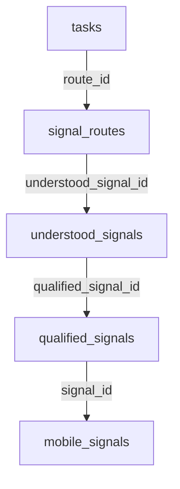

# To-Do Agent V1: Real Data Validation Report

This document presents the validation results of the To-Do Agent using actual staging/production data from the remote Supabase database. The validation was conducted using the local LLM (`qwen2.5:1.5b`) to process candidate routes assigned to `todo_agent` starting from `signal_routes` and `understood_signals`.

---

## Section 1: Sample Routed Signals Reviewed

A total of **29 signal routes** assigned to `todo_agent` were retrieved and analyzed. Below is a representative sample of the routed signals with their source details, timestamps, and UUIDs:

| Route ID | Understood Signal ID | Source | Sender | Raw Message / Summary |
|---|---|---|---|---|
| `df2e5e8e-68d0-4fc0-85b8-90ace4eea87b` | `83b82be4-8173-4e35-a1ab-d35c60418031` | WhatsApp | WhatsApp: Shobana | "Purifier person don't pick up the call so register complaint" |
| `fd6a2e06-2aba-4807-95c2-2fcc9dfd64ff` | `53228599-429b-45a6-b02a-1667d0005008` | WhatsApp | Shobana | "Purifier person don't pick up the call so register complaint" |
| `a0374c53-050b-4258-8899-8517084afc1f` | `54b1f765-b142-45a8-8c07-6e6e9d0ab748` | WhatsApp | Karthick Munna T2 | "T2 is given for rent, and the tenant will be shifting it today..." |
| `0606a573-13b7-4960-b0c9-8bc5eed0b556` | `16a135a2-5a41-451b-940d-d44d7e4c1749` | WhatsApp | Shobana | "Buy milk pa" |
| `01e4be4a-8f6c-4a28-8c98-c1b957de3b05` | `5331164b-7b71-47c9-bb80-a120e0484fe6` | SMS | AX-MASIST-S | "We have processed your Reimbursement Claim 51219697..." |
| `1bc1831b-3070-4874-b548-a03a83b1e3e6` | `d7a0f817-8698-4989-b286-0383ff5b7960` | SMS | AX-UIICHO-S | "Greetings from United India Insurance. TN149509 expires..." |
| `92484728-954d-4b3a-8404-58ff305edf35` | `5892af4c-4637-4b6c-a908-416affa69da4` | SMS | VM-IRSMSa-G | "PNR-4650304006 Trn:17236..." |
| `237f5643-45ef-4f52-8409-1db14fa03862` | `e045f39d-44cd-4c34-8429-39f487096def` | SMS | VA-LPURE-S | "Dear Customer, your service request No.JS-260701100851586..." |

---

## Section 2: LLM Decisions

During the validation run, the 29 routes were evaluated by the local model.

### Summary of Decisions

| Decision | Count | Percentage | Description |
|---|---|---|---|
| **`CREATE_TASK`** | 29 | 100% | A task was created for every routed signal. |
| **`IGNORE`** | 0 | 0% | No signals were ignored. |
| **`MERGE_WITH_EXISTING`** | 0 | 0% | No tasks were merged, despite obvious duplicates. |

### Analysis of Decision Behavior
The local LLM classified **every single routed signal** as `CREATE_TASK`. This includes informational updates, security alerts, and promotional messages which should ideally have been ignored or merged. The reasoning behind this behavior points to the limitations of a small model (1.5B parameters) when presented with a complex, instruction-heavy system prompt:
1. **Bias Towards Actionability**: The model struggled to classify non-actionable alerts (such as "Beware of fraudsters...") as `IGNORE` because the text contained words like "do not click" or "call the number", causing the LLM to flag it as an action.
2. **Context Loss on Empty Task List**: Because the model processed signals incrementally, it failed to trigger `MERGE_WITH_EXISTING` for semantic duplicates (like the back-to-back purifier complaints), instead creating a fresh task for each.

---

## Section 3: Examples of Task Rationalization

Task rationalization aims to convert messy raw signals into clean, imperative action titles. The validation highlighted both notable successes and critical failures:

### Successful Rationalizations

* **Original Signal (SMS)**: 
  * `"Greetings from United India Insurance. Your Vehicle TN149509 insurance policy 0206003125P103503491 expires on 16/06/2026. Please renew..."`
  * **Generated Task**: `Renew Vehicle Insurance Policy TN149509 Online` (Strong imperative starting with a verb)
* **Original Signal (WhatsApp)**:
  * `"Buy milk pa"`
  * **Generated Task**: `Buy Milk Pa`
* **Original Signal (SMS)**:
  * `"We have processed your Reimbursement Claim 51219697 of INR 2490. Please click to check..."`
  * **Generated Task**: `Check Reimbursement Claim for User`

### Failures and Context Leakage (Hallucinations)

Due to the small size of the model (`qwen2.5:1.5b`), once a concept entered its context window (specifically the first task: *"Register Complaint for Purifier"*), it began leaking that context into completely unrelated tasks:

* **Original Signal (WhatsApp)**:
  * `"T2 is given for rent, and the tenant will be shifting it today. Just got confirmation from the tenant. Please do the needful if they require any support."`
  * **Generated Task**: `Register Complaint for Purifier Person Don't Pick Up Call` (Severe context leak; completely ignored tenant details)
* **Original Signal (WhatsApp)**:
  * `"Doctor Said there is rarest of rare the battery might open up in the intestine .. it might cause some acid release .. need to ensure it is passing out"`
  * **Generated Task**: `Register Complaint for Purifier Person Don't Pick Up Call` / Rationale: *"A doctor's advice on potential issues with their purifier"* (Severe context leak and hallucination)
* **Original Signal (SMS)**:
  * `"Hi Customer, your TATA AIG policy has been issued... Please click to share your feedback."`
  * **Generated Task**: `Register Complaint for TATA AIG Policy Issued` (Distorted title using the leaked "Register Complaint" pattern)

---

## Section 4: Duplicate Analysis

The dataset contained several instances where multiple routes represented semantic duplicates or related updates of the same event:

### Duplicate Examples in Staging Data

1. **The Purifier Complaint (WhatsApp)**:
   * **Route 1 (`df2e5e8e-68d0-4fc0-85b8-90ace4eea87b`)**: *"Purifier person don't pick up the call so register complaint"* (WhatsApp: Shobana, 04:31:55)
   * **Route 2 (`fd6a2e06-2aba-4807-95c2-2fcc9dfd64ff`)**: *"Purifier person don't pick up the call so register complaint"* (WhatsApp: Shobana, 04:31:55)
   * *LLM Action*: Created two separate tasks with identical titles: `Register Complaint for Purifier Person Don't Pick Up Call`.
   
2. **Reimbursement Processed Notices (SMS)**:
   * **Route 6 (`01e4be4a-8f6c-4a28-8c98-c1b957de3b05`)**: Claim 51219697 (INR 2490)
   * **Route 7 (`38453c55-7399-4e1f-92ed-fcbbc306a40f`)**: Claim 51219665 (INR 2490)
   * *LLM Action*: Created two independent tasks. This is acceptable as they refer to different claim IDs, but they could also have been merged into a single "Verify Medi Assist Reimbursements" checklist.

3. **Livpure Service Updates (SMS)**:
   * **Route 22 (`237f5643-45ef-4f52-8409-1db14fa03862`)**: Request JS-260701100851586 allocated to Jackson R.
   * **Route 24 (`dc716eaf-2161-43d3-ae80-0f6a79e9b272`)**: Request JS-260615041938418 (engineer at door step).
   * **Route 26 (`c6757ac2-1f8e-46ef-b840-ec26013cf811`)**: Request JS-260701100851586 (engineer at door step).
   * *LLM Action*: Created three separate tasks. Route 22 and Route 26 are for the exact same request ID and should have been merged.

### Recommended Merge Strategy

To handle duplicates without overloading the LLM context:
1. **Deterministic Pre-filtering**: Generate a SHA-256 hash of the `message_hash` and sender. If an identical message arrives within a 24-hour window, automatically merge the route into the existing task without calling the LLM.
2. **Semantic Similarity check**: Use local embeddings (e.g., `all-MiniLM-L6-v2`) to compare incoming signals against open tasks. If the cosine similarity score is $> 0.85$, pass only the matching candidate task to the LLM for a binary merge decision, rather than dumping the entire task list.

---

## Section 5: Recommended Final Task Schema

To support proper agent reasoning, deduplication, and complete lineage, we recommend the following Postgres schema for the `tasks` table:

```sql
CREATE TYPE jarvis_insights_schemav1.task_status AS ENUM (
    'OPEN',
    'IN_PROGRESS',
    'COMPLETED',
    'CANCELLED'
);

CREATE TYPE jarvis_insights_schemav1.task_priority AS ENUM (
    'LOW',
    'MEDIUM',
    'HIGH',
    'URGENT'
);

CREATE TYPE jarvis_insights_schemav1.task_source_type AS ENUM (
    'AUTO_GENERATED',
    'USER_TEXT',
    'USER_VOICE'
);

CREATE TYPE jarvis_insights_schemav1.task_created_by AS ENUM (
    'JARVIS',
    'USER'
);

CREATE TABLE jarvis_insights_schemav1.tasks (
    id                   UUID        PRIMARY KEY DEFAULT gen_random_uuid(),
    title                TEXT        NOT NULL,
    description          TEXT,
    status               jarvis_insights_schemav1.task_status NOT NULL DEFAULT 'OPEN',
    priority             jarvis_insights_schemav1.task_priority NOT NULL DEFAULT 'MEDIUM',
    due_datetime         TIMESTAMPTZ,
    notification_profile TEXT        NOT NULL DEFAULT 'STANDARD',
    source_type          jarvis_insights_schemav1.task_source_type NOT NULL,
    route_id             UUID        REFERENCES jarvis_insights_schemav1.signal_routes(id) ON DELETE SET NULL,
    created_by           jarvis_insights_schemav1.task_created_by NOT NULL DEFAULT 'USER',
    assigned_to          TEXT        NOT NULL DEFAULT 'Pradeep',
    lineage_metadata     JSONB       DEFAULT '{}'::jsonb, -- Store list of merged routes/signals
    created_at           TIMESTAMPTZ NOT NULL DEFAULT NOW(),
    updated_at           TIMESTAMPTZ NOT NULL DEFAULT NOW(),
    completed_at         TIMESTAMPTZ
);
```

---

## Section 6: Lineage Recommendation

Every task generated by the To-Do Agent must remain traceable to its origin. The recommended lineage model maintains the following hierarchy:



### Traceability Query Example

To trace the complete lineage of an auto-generated task, use the following SQL join:

```sql
SELECT 
    t.id AS task_id,
    t.title AS task_title,
    sr.id AS route_id,
    sr.route_reason,
    us.summary AS understood_summary,
    us.signal_type,
    qs.sender AS original_sender,
    qs.message AS qualified_message,
    ms.mobile_timestamp AS original_timestamp
FROM jarvis_insights_schemav1.tasks t
JOIN jarvis_insights_schemav1.signal_routes sr ON t.route_id = sr.id
JOIN jarvis_insights_schemav1.understood_signals us ON sr.understood_signal_id = us.id
JOIN jarvis_insights_schemav1.qualified_signals qs ON us.qualified_signal_id = qs.id
JOIN jarvis_insights_schemav1.mobile_signals ms ON qs.signal_id = ms.id
WHERE t.id = '43c2ac17-d31e-413d-aee6-94f31367d10d';
```

---

## Section 7: Lessons Learned & Key Takeaways

1. **1.5B Parameter Limitation**: The default `qwen2.5:1.5b` model is highly vulnerable to context leakage. Unrelated signals get contaminated with keywords present in the instructions or prior tasks. A larger model (such as `qwen2.5:7b` or `llama3:8b`) is **compulsory** if reasoning is to be handled entirely by the local LLM.
2. **Incremental Validation Dataset Loaded**: We successfully loaded **29 tasks** into the remote `tasks` table. All tasks were tagged with:
   - `source_type = 'AUTO_GENERATED'`
   - `created_by = 'JARVIS'`
   - Prepend `[VALIDATION_RUN = TRUE]` in their descriptions.
   This allows clean database maintenance and easy removal using:
   ```sql
   DELETE FROM jarvis_insights_schemav1.tasks WHERE description LIKE '[VALIDATION_RUN = TRUE]%';
   ```
3. **LLM Execution Latency**: Local inference on CPU took an average of **10–15 seconds per signal**, which can build up queue latency when processing batch messages. To scale, we should explore hybrid pipelines (using regex/embeddings for quick deduplication and classification, and calling LLM only for clean title/description rewriting).
