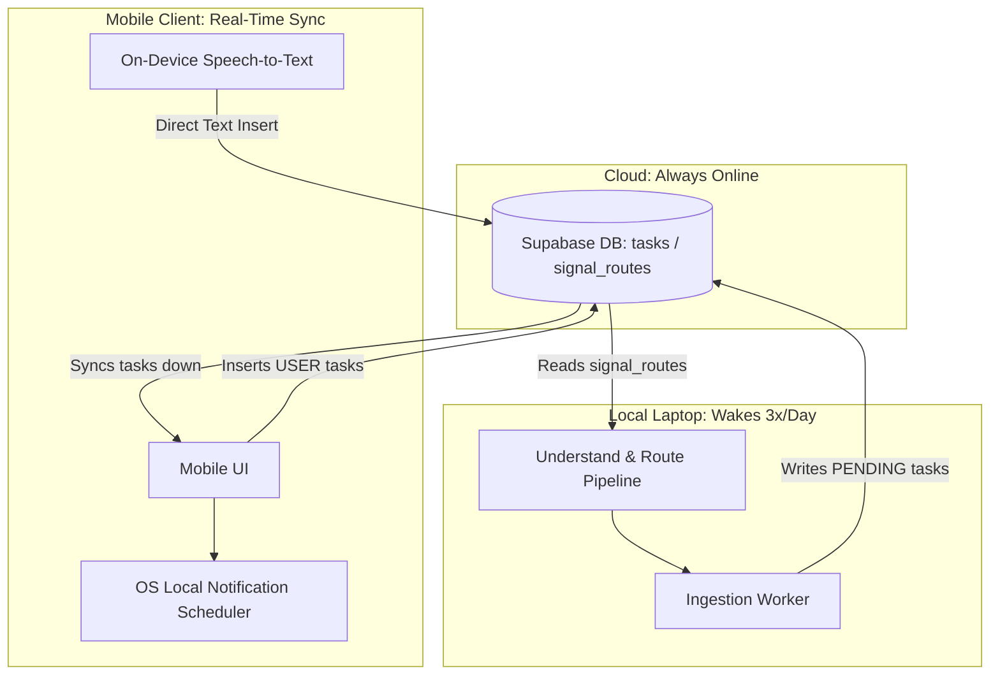

# TODO AGENT BLUEPRINT (V1)
**Jarvis Personal Operating System — To-Do Agent Design Specification**

---

## 1. End-to-End Architecture & Synchronization Topology

To keep Jarvis simple, light, and private, the architecture utilizes a hybrid offline/online synchronization topology. 

### Synchronization Actors
1. **Supabase (Cloud)**: Always online. Serves as the real-time data sync coordinator between the mobile app and the backend.
2. **Laptop Backend (Local)**: Wakes up **3 times a day**. Upon wake, it runs the understanding and routing pipeline, writes auto-generated tasks to Supabase, and goes back to sleep.
3. **Mobile Client (Local Device)**: Always online. It syncs directly with Supabase in near real-time to write user-created tasks and read all active tasks.



### Ingestion Workflows

#### Source A: System-Generated Ingestion (Batch-Processed 3x Daily)
1. **Laptop Wake**: The local laptop wakes up.
2. **Audit Check**: The ingestion worker queries the cloud Supabase `signal_routes` table for `agent_name = 'todo_agent'` and `route_status = 'PENDING'`.
3. **Signal Integration**: For each pending route, the worker:
   - Fetches the parent contract from `understood_signals` via the route linkage.
   - Synthesizes a task record (title, due date, priority).
   - Writes the new task to the cloud Supabase `tasks` table with `source_type = 'AUTO_GENERATED'` and **`route_id` pointing directly to the corresponding row in `signal_routes`**. This ensures strict 1-to-1 operational auditing lineage.
   - Updates the `signal_routes` row to `COMPLETED`.
4. **Laptop Sleep**: The laptop goes back to sleep.

#### Source B: User-Created Ingestion (Real-Time Cloud Insert)
1. **User Text**: The mobile app inserts a task record directly into Supabase via client library.
2. **User Voice**: The mobile app performs **On-Device Speech-to-Text** (using native iOS/Android speech recognizers). Once transcribed, the app parses the text locally (or uploads text to a lightweight parser) and inserts the record directly into Supabase. No raw audio files are uploaded to the laptop backend.

---

## 2. Task Schema

All system-generated and user-created tasks converge into a single unified `tasks` table. To support multiple future users (e.g. Charan, Chinicka, Shobana, Pradeep) and modular notification frequencies, ownership and notification profiles are integrated directly into the schema.

```sql
CREATE TYPE jarvis_insights_schemav1.task_status AS ENUM (
    'OPEN',
    'IN_PROGRESS',
    'COMPLETED',
    'CANCELLED'
);

CREATE TYPE jarvis_insights_schemav1.task_priority AS ENUM (
    'LOW',
    'MEDIUM',
    'HIGH',
    'URGENT'
);

CREATE TYPE jarvis_insights_schemav1.task_source_type AS ENUM (
    'AUTO_GENERATED',
    'USER_TEXT',
    'USER_VOICE'
);

CREATE TYPE jarvis_insights_schemav1.task_created_by AS ENUM (
    'JARVIS',
    'USER'
);

CREATE TABLE IF NOT EXISTS jarvis_insights_schemav1.tasks (
    id                   UUID        PRIMARY KEY DEFAULT gen_random_uuid(),
    title                TEXT        NOT NULL,
    description          TEXT,
    status               jarvis_insights_schemav1.task_status NOT NULL DEFAULT 'OPEN',
    priority             jarvis_insights_schemav1.task_priority NOT NULL DEFAULT 'MEDIUM',
    due_datetime         TIMESTAMPTZ,
    notification_profile TEXT        NOT NULL DEFAULT 'STANDARD', -- NONE | STANDARD | IMPORTANT | CRITICAL
    source_type          jarvis_insights_schemav1.task_source_type NOT NULL,
    route_id             UUID        REFERENCES jarvis_insights_schemav1.signal_routes(id) ON DELETE SET NULL,
    created_by           jarvis_insights_schemav1.task_created_by NOT NULL DEFAULT 'USER',
    assigned_to          TEXT        NOT NULL DEFAULT 'Pradeep',  -- Prepares schema for Charan, Chinicka, Shobana, etc.
    created_at           TIMESTAMPTZ NOT NULL DEFAULT NOW(),
    updated_at           TIMESTAMPTZ NOT NULL DEFAULT NOW(),
    completed_at         TIMESTAMPTZ
);

-- Performance Indexes
CREATE INDEX IF NOT EXISTS idx_tasks_status ON jarvis_insights_schemav1.tasks(status);
CREATE INDEX IF NOT EXISTS idx_tasks_due_datetime ON jarvis_insights_schemav1.tasks(due_datetime) WHERE status = 'OPEN';
CREATE INDEX IF NOT EXISTS idx_tasks_route_id ON jarvis_insights_schemav1.tasks(route_id) WHERE route_id IS NOT NULL;
```

---

## 3. Simplified Notification Architecture (Mobile-Driven)

Since the laptop backend is offline most of the day, a backend notification scheduler is highly impractical and overcomplicates the setup. Instead, we use **Mobile-Side Local Alerts** configured via profiles:

```
Supabase DB (tasks) ──> Real-Time Sync ──> Mobile Client ──> OS Local Alert Scheduler
```

1. **Subscription**: The mobile app maintains an active subscription/sync to the Supabase `tasks` table.
2. **Local Scheduling & Profiles**: When the mobile app receives updates, it filters tasks for those where `status = 'OPEN'`. It computes multiple alert times depending on the `notification_profile`:
   - `NONE`: No alarms scheduled.
   - `STANDARD`: 1 alert scheduled (e.g. 1 day before due date at 9 AM).
   - `IMPORTANT`: 2 alerts scheduled (e.g. 1 day before + same day at 9 AM).
   - `CRITICAL`: 3 alerts scheduled (e.g. 7 days before + 1 day before + same day at 9 AM).
3. **Register Reminders**: The app calls native mobile OS scheduling APIs (e.g., Apple's `UNUserNotificationCenter` or Android's `AlarmManager`) to schedule local banner notifications on the device for the computed timestamps.
4. **Cancellation**: If a task is marked `COMPLETED` or `CANCELLED`, the mobile app cancels the scheduled local reminders on the OS.

*Benefits: Zero cloud cron servers, no push server configurations (FCM/APNs), completely offline-capable notification dispatch.*

---

## 4. Mobile Integration & Sync Flow

The mobile application connects directly to Supabase using the standard client library, utilizing Supabase's built-in security features (RLS) to query, insert, and update tasks:

* **Task Completion**: When a user taps check:
  ```javascript
  supabase.from('tasks').update({ status: 'COMPLETED', completed_at: new Date() }).eq('id', taskId)
  ```
* **Real-time Sync**: The app listens to live mutations:
  ```javascript
  supabase.channel('tasks-channel').on('postgres_changes', { event: '*', schema: 'jarvis_insights_schemav1', table: 'tasks' }, payload => {
      // Sync local UI and update device local notifications
  }).subscribe()
  ```

---

## 5. Voice Flow

By running transcription locally on the client, we prevent audio processing bottlenecks on the local laptop:

1. **User Dictation**: User speaks a command into the app.
2. **On-Device STT**: The mobile device transcribes speech to text in real-time (using Apple Speech framework or Android SpeechRecognizer).
3. **Simple Text Parsing**: A lightweight NLP parser extracts parameters (e.g., matching due date patterns like "tomorrow" or "next Friday").
4. **Supabase Write**: The app writes the text task directly to the `tasks` table.

---

## 6. Morning Briefing Integration

The Morning Briefing compiles upcoming deliverables into a structured, easily readable summary.

### Ingestion Query Strategy
Every morning, the local laptop pulls the tasks from Supabase when it wakes up to generate the briefing:
* **Overdue Tasks**: `status = 'OPEN' AND due_datetime < TODAY`
* **Due Today**: `status = 'OPEN' AND due_datetime >= TODAY AND due_datetime < TOMORROW`
* **Upcoming Weekly**: `status = 'OPEN' AND due_datetime >= TOMORROW AND due_datetime <= TODAY + INTERVAL '7 days'`

The briefing text is synthesized by the laptop's local LLM during its wake cycle, written back to a briefing table in Supabase, and synced immediately to the mobile app for the user to read.

---

## 7. Validation Strategy

Strict validation rules apply to incoming tasks:
* **`title`**: String, minimum length 3 characters, maximum length 250 characters.
* **`status`**: Enforced enum check (`OPEN`, `IN_PROGRESS`, `COMPLETED`, `CANCELLED`).
* **`priority`**: Enforced enum check (`LOW`, `MEDIUM`, `HIGH`, `URGENT`).
* **`due_datetime`**: Valid ISO 8601 timestamp.
* **`notification_profile`**: Enforced profile check (`NONE`, `STANDARD`, `IMPORTANT`, `CRITICAL`).

---

## 8. Migration Strategy

The deployment of the To-Do Agent V1 will follow a strict path to avoid operational downtime:

1. **Step 1: Execute Schema Migrations**:
   Run DDL scripts in Supabase to declare the custom `ENUM` types and create the `tasks` table.
2. **Step 2: Laptop Ingestion Worker Deployment**:
   Deploy the background worker script on the local laptop that pulls from `signal_routes` and populates the `tasks` table on Supabase when the laptop wakes up.
3. **Step 3: Mobile Client Integration**:
   Configure the mobile app to sync from the `tasks` table in Supabase and hook up the local notification scheduler.
