# Jarvis Architecture Review

This document provides a detailed overview of the system architecture, execution flow, module inventory, database mappings, and configurations for **Jarvis AI OS**.

---

## 1. System Architecture Diagram

```mermaid
graph TD
    %% Entry Points
    FastAPI[FastAPI Server: main.py] -->|Start uvicorn on port 8000| WebAPI[Web API Layer]
    FastAPI -->|Daemon Thread| RuntimeLoop[run_runtime Loop]
    RuntimeLoop -->|Startup Context| Startup[startup.py: startup]

    %% Startup Sequence
    Startup -->|1. Initialize System| SystemInit[system_initializer.py: initialize_system]
    SystemInit -->|Load Configurations| ContextProvider[context_provider.py]
    SystemInit -->|Initialize schemas/migrate| SQLiteDB[storage/db/database.py]
    SystemInit -->|Ping local LLM router| Router[intelligence/routing/router.py]

    %% Ingestion Pipelines
    Startup -->|2. Sync Mobile| ConsumerService[consumer_service.py: ConsumerService.run_sync]
    ConsumerService -->|Download JSONs| SupabaseStorage[(Supabase Storage Bucket)]
    ConsumerService -->|Save raw signals| MobileSignalRepo[mobile_signal_repository.py]

    Startup -->|3. Process Mobile Signals| MobilePipe[mobile_signal_pipeline.py: MobileSignalPipeline.run]
    MobilePipe -->|Fetch unprocessed| MobileSignalRepo
    MobilePipe -->|Noise filter checks| NoiseFilter[mobile_noise_filter.py]
    MobilePipe -->|LLM classification/extraction| IntentExtractor[mobile_intent_extractor.py]
    IntentExtractor -->|Local/Cloud routing| Router
    MobilePipe -->|Deduplicate & save| SignalRepo[signal_repository.py]
    MobilePipe -->|If action required| TaskRepo[task_repository.py]

    Startup -->|4. Process Emails| EmailPipe[email_pipeline.py: EmailPipeline.run]
    EmailPipe -->|Fetch unread| GmailAPI[Gmail API Client]
    EmailPipe -->|Noise filters & LLM| EmailExtractor[email_intent_extractor.py]
    EmailPipe -->|Save structured| SignalRepo
    EmailPipe -->|If action required| TaskRepo

    %% Scheduler
    Startup -->|5. Initialize Background Jobs| Scheduler[scheduler.py: JarvisScheduler]
    Scheduler -->|Every 30s| Heartbeat[runtime_heartbeat]
    Scheduler -->|Every N mins| PollSync[run_consumer_sync]
    PollSync --> ConsumerService

    %% Post Processing & Aggregation Scripts
    Scripts[Cron/Reprocess Scripts] -->|6. Classify & Extract Entities| SignalProcessor[signal_processor.py]
    SignalProcessor -->|Classify signals| Classification[signal_classification]
    SignalProcessor -->|Extract Todos| SupabaseRepo[supabase_repo.py: create_todo]
    SignalProcessor -->|Extract Financials| SupabaseRepo[supabase_repo.py: create_financial_event]
    SignalProcessor -->|Extract FYIs| SupabaseRepo[supabase_repo.py: create_fyi_event]

    Scripts -->|7. Outflow Analysis| FinIntel[financial_intelligence.py: FinancialIntelligenceService]
    FinIntel -->|Local aggregations| SQLiteDB
    FinIntel -->|Classify Categories| FinClassifier[financial_classifier.py]

    Scripts -->|8. Daily Briefs| BriefGen[daily_brief_generator.py]
    BriefGen -->|Compile JSON| SQLiteDB
    BriefGen -->|Sync to cloud| SupabaseSync[supabase_sync_service.py]

    %% Frontends
    Streamlit[Streamlit UI: ui/app.py] -->|Read live| SupabaseRepo
    AndroidApp[Android Dashboard] -->|Read live| SupabaseRepo
```



---

## 2. Runtime Execution Flow

```text
[Startup Execution Flow]

FastAPI Entry Point (app/main.py)
   │
   ├── Start uvicorn thread (runs Web APIs on port 8000)
   └── Start run_runtime daemon thread
         │
         └── app/startup.py: startup()
               │
               ├── 1. services/system_initializer.py: initialize_system()
               │      ├── Load User Context (user_context.json)
               │      ├── Initialize SQLite Database (run migrations / recreate schemas)
               │      └── Ping LLM Router (verifies local LLM is READY)
               │
               ├── 2. consumer/consumer_service.py: ConsumerService.run_sync()
               │      ├── Scan Supabase storage folder (pradeep/, shobana/, incoming/)
               │      ├── Download & hash JSON files
               │      ├── Check file deduplication (processed_files)
               │      ├── Parse & write raw messages to SQLite table (mobile_signals)
               │      ├── Archive files locally on the machine
               │      └── Move files to Supabase archive/ folder
               │
               ├── 3. services/mobile_signal_pipeline.py: MobileSignalPipeline.run()
               │      ├── Query unprocessed SQLite mobile signals (limit 100)
               │      ├── Parse mobile timestamp & filter older than 90 days
               │      ├── Run MobileNoiseFilter rules
               │      ├── Invoke MobileIntentExtractor (LLM intent & structured JSON details)
               │      ├── Check cross-channel duplicates (signals table)
               │      ├── Write structured record to SQLite table (signals)
               │      ├── If action_required: Write to SQLite table (tasks)
               │      └── Mark mobile signal processed in SQLite
               │
               ├── 4. services/email_pipeline.py: EmailPipeline.run()
               │      ├── Fetch unread emails from Gmail Client
               │      ├── Check deduplication & run EmailNoiseFilter rules
               │      ├── Invoke EmailIntentExtractor (LLM intent & details)
               │      ├── Check cross-channel duplicates (signals table)
               │      ├── Save structured record to SQLite table (signals)
               │      ├── If action_required: Write to SQLite table (tasks)
               │      └── Mark email processed
               │
               └── 5. orchestration/scheduler/scheduler.py: JarvisScheduler.start()
                      ├── Add interval job: runtime_heartbeat (every 30 seconds)
                      └── Add interval job: run_consumer_sync (every settings.consumer_poll_interval_minutes)
```

---

## 3. Module Inventory

### 1. Web API Layer (`api/`)
* **Purpose**: Serves HTTP endpoints for external consumers (e.g., Android app, WebHooks).
* **Responsibilities**:
  * Health checks (`/health`).
  * Mobile ingestion/sync endpoints.
  * Fetching financial intelligence categories.
* **Dependencies**: fastapi, uvicorn.

### 2. Ingestion Service (`consumer/`)
* **Purpose**: Fetches raw data exports from Supabase Storage and parses them.
* **Responsibilities**:
  * Authenticates and queries files using `SupabaseClient`.
  * Computes file SHA256 hashes to prevent duplicate file loads.
  * Parses JSON lists of raw mobile notifications (`FileProcessor`).
  * Moves processed files to the `archive/` remote folder and deletes/archives locally (`ArchiveManager`).
* **Dependencies**: supabase, hashlib, python-dotenv.
* **Owner Tables**: `processed_files`, `mobile_signals`.

### 3. System Orchestrator & Scheduler (`app/`, `orchestration/`)
* **Purpose**: Initializes the runtime environment and drives cron loops.
* **Responsibilities**:
  * Bootstraps system, initializes tables, verifies model endpoint health on startup.
  * Schedules periodic synchronization and heartbeats.
  * Manages graceful shutdown.
* **Dependencies**: apscheduler, loguru.
* **Owner Tables**: `runtime_events`.

### 4. Intent Extraction & Normalization Engines (`services/mobile_signal_pipeline.py`, `services/email_pipeline.py`)
* **Purpose**: Takes raw signals and parses out intents, priorities, summaries, and structured metadata.
* **Responsibilities**:
  * Checks 90-day execution limits.
  * Filters out noise programmatically (e.g. system status, media status, OTPs).
  * Calls Local LLM using structured routing to extract structured JSON intents (e.g. `financial_transaction`, `school_update`, `personal_chat`, `shopping_order`).
  * Runs cross-channel duplicate comparison checks.
* **Dependencies**: `MobileNoiseFilter`, `MobileIntentExtractor`, `EmailNoiseFilter`, `EmailIntentExtractor`.
* **Owner Tables**: Writes to `signals` and `tasks` (SQLite).

### 5. Signal Classification & Entity Extraction (`services/signal_processor.py`)
* **Purpose**: Categorizes signals and extracts actionable items to specific schemas.
* **Responsibilities**:
  * Rules-based classification into categories (`IGNORE`, `INSURANCE`, `FINANCIAL`, `TODO`, `FYI`).
  * `extract_todos()`: Processes Todo signals, resolves due dates, and upserts them to Supabase `todos` and local SQLite `todos`.
  * `extract_financial_events()`: Processes financial signals, parses transaction info/amounts, and maps categories using `RulesEngine`.
  * `extract_fyi_events()`: Processes FYI signals, groups them into notifications (e.g. school circulars, travel bookings, family updates).
* **Dependencies**: `RulesEngine`, `SupabaseRepo`.
* **Owner Tables**: `signal_classification`, `todos`, `financial_events`, `fyi_events`.

### 6. Rules Engine (`services/rules_engine.py`)
* **Purpose**: Centralized rule evaluator to handle overrides, ignore lists, and category mappings.
* **Responsibilities**:
  * Loads and hot-reloads `jarvis_rules.json` and `user_overrides.json` from disk.
  * Filters out unconditionally and conditionally ignored topics (e.g., Badminton alerts unless exceptions match).
  * Maps merchants, VPAs, and description keywords to structured spend categories.
* **Dependencies**: None.

### 7. Financial Outflow Intelligence (`services/financial_intelligence.py`, `services/financial_aggregator.py`, `services/financial_classifier.py`)
* **Purpose**: Summarizes expense outputs, categorizes debit transactions, and computes trends.
* **Responsibilities**:
  * Detects and classifies internal transfer legs (dual credit-debit legs within 24 hours of matching amounts/banks).
  * Runs `FinancialClassifier` (with rules check + LLM fallback) to resolve transaction categories.
  * Performs monthly category spend aggregation and Month-on-Month trend change percentages.
* **Dependencies**: `SupabaseRepo`, `FinancialClassifier`.
* **Owner Tables**: `monthly_spending_summary`, `monthly_category_spend`, `monthly_category_trends`, `financial_transaction_classification`.

### 8. Daily Brief Generator (`services/daily_brief_generator.py`)
* **Purpose**: Compiles daily intelligence rollups for the user.
* **Responsibilities**:
  * Gathers current/overdue todos, financial events, and fyi events for a targeted date.
  * Generates warning/highlight items (e.g. high-value expenses, upcoming renewals).
  * Syncs compiled JSON payloads to Supabase `daily_briefs`.
* **Dependencies**: `SessionLocal`, `SupabaseSyncService`.
* **Owner Tables**: `daily_briefs`.

### 9. Intelligence Routing Router (`intelligence/`)
* **Purpose**: Manages communication with LLM backends.
* **Responsibilities**:
  * Combines prompt text with user context.
  * Directs prompts to `LocalLLM` (Ollama client calling the local model) or `CloudLLM` (unimplemented placeholder).
* **Dependencies**: ollama.

---

## 4. Feature Inventory

### Todo Engine
* **Current Features**:
  * Todo Extraction from signals.
  * Due Date parsing and normalization (translates "tomorrow", formats "DD-MM-YYYY", "DD MMM").
  * Priority mapping (High, Medium, Low) inherited from signal importance.
  * Cutoff filters (prevents pushing stale tasks older than 90 days to Supabase).
* **Current Gaps**:
  * No duplicate task detection (multiple signals with similar text generate multiple tasks).
  * No automatic task state reconciliation (if the user completes a task in WhatsApp/real life, Jarvis doesn't close it automatically).
  * No snoozing/deferral logic.

### Financial Engine
* **Current Features**:
  * Transaction amount regex parsing.
  * Rules-based category classification (merchants, VPA patterns, keyword checks).
  * LLM-based fallback classification.
  * Internal transfer detection (cross-referencing credit/debit legs).
  * Calendar-month rollups and MoM percentage trend updates.
  * 90-day ingestion limits on remote tables.
* **Current Gaps**:
  * Recurring bill extraction (automatic detection of monthly cycles like rent or subscriptions).
  * Multi-currency support (exclusively assumes INR / standard currency prefixes).
  * Automatic credit card statement parsing.

### FYI Engine
* **Current Features**:
  * Categorization of notifications into `school_circular`, `family_update`, `travel_update`, `delivery_notification`.
  * 7-day age cutoff to prevent dashboard clutter.
* **Current Gaps**:
  * No notification grouping (floods the dashboard if multiple messages arrive for the same delivery package).
  * No action items linkage (school updates often contain both FYI info and silent todos, but they aren't cross-linked).

---

## 5. Database Mapping

### SQLite (Local Database)
| SQLite Table Name | Purpose | Producer Module | Consumer Module |
| :--- | :--- | :--- | :--- |
| `runtime_events` | Logs system startup/shutdown and critical events | `system_initializer.py` | Sysadmin/Logs |
| `mobile_signals` | Ingests raw JSON notifications from Supabase | `ConsumerService` | `MobileSignalPipeline` |
| `signals` | Stores structured, unified parsed signals | `MobileSignalPipeline`, `EmailPipeline` | `SignalProcessor` |
| `tasks` | Logs intermediate tasks before extraction | `MobileSignalPipeline`, `EmailPipeline` | `SignalProcessor` |
| `signal_classification` | Maps signals to category classification targets | `SignalProcessor.classify_signal` | Entity extraction pipelines |
| `todos` | Stores extracted tasks locally | `SignalProcessor.extract_todos` | Dashboard/Briefs |
| `financial_events` | Stores structured transactions locally | `SignalProcessor.extract_financial_events` | `FinancialIntelligenceService` |
| `fyi_events` | Stores informational records locally | `SignalProcessor.extract_fyi_events` | Daily brief compiler |
| `daily_briefs` | Stores generated daily briefs locally | `DailyBriefGenerator` | `SupabaseSyncService` |
| `monthly_spending_summary` | Outflow expenditure stats per month | `FinancialIntelligenceService` | Local UI |
| `monthly_category_spend` | Category group amounts per month | `FinancialIntelligenceService` | Local UI |
| `monthly_category_trends` | Month-on-month change trends | `FinancialIntelligenceService` | Local UI |
| `financial_transaction_classification` | Outflow category classifications | `FinancialIntelligenceService` | Local UI |
| `processed_files` | Tracks downloaded storage JSON filenames and hashes | `ConsumerService` | Ingestion scheduler |
| `classification_cache` | Caches LLM response values against string hashes | `MobileIntentExtractor`, `FinancialClassifier` | Intent/Transaction pipelines |

### Supabase (Remote Database - Schema: `jarvis_insights_schema`)
| Supabase Table Name | Purpose | Producer Module | Consumer Module |
| :--- | :--- | :--- | :--- |
| `signals` | Stores structured unified signals | `SignalProcessor` | Remote Dashboards |
| `todos` | Stores active, live tasks | `SignalProcessor.extract_todos` | Streamlit, Android |
| `financial_events` | Stores live transactions | `SignalProcessor.extract_financial_events` | Streamlit, Android |
| `fyi_events` | Stores recent informational events | `SignalProcessor.extract_fyi_events` | Streamlit, Android |
| `facts` | Stores extracted user profile/fact facts | `SupabaseRepo` | AI Profile dashboards |
| `user_preferences` | Key-value database of user settings | `SupabaseRepo` | Custom engines |
| `user_actions` | Logs actions performed by the user | `SupabaseRepo` | AI behavior tracking |
| `salary_cycles` | Records user salary events | `SupabaseRepo` | Budgeting dashboard |
| `monthly_spending_summary` | Spending outflow stats per month | `FinancialAggregator` | Streamlit Dashboard |
| `monthly_category_spend` | Category group amounts per month | `FinancialAggregator` | Streamlit Dashboard |
| `monthly_category_trends` | Month-on-month change trends | `FinancialAggregator` | Streamlit Dashboard |
| `financial_transaction_classification` | Classification records | `FinancialAggregator` | Streamlit Dashboard |
| `processed_files` | Sync record of ingestion pipelines | `ConsumerService` | Remote dashboards |

---

## 6. Configuration Inventory

| Configuration Source | Location | Purpose | Consumed By |
| :--- | :--- | :--- | :--- |
| Environment Variables | `.env` | Holds database URLs, credentials, Ollama API URLs, keys | `configs/settings.py` |
| Application Settings | `configs/settings.py` | Parses `.env` variables and provides defaults | Entire codebase |
| User Context Context | `config/user_context.json` | Holds user's personal details, priorities, spouse/children names | `ContextProvider.get_context_prompt()` |
| Rules Engine Rules | `config/jarvis_rules.json` | Rules lists for ignore topics, conditional topics, merchant/VPA mappings | `RulesEngine` |
| User Rules Overrides | `config/user_overrides.json` | Custom user transaction category overrides | `RulesEngine` |
| Mailbox Registry | `configs/mailbox_registry.json` | Maps email accounts for the mail pipeline | `EmailPipeline` |
| Google Credentials | `configs/google_credentials.json` | Oauth token configurations for Gmail | `GmailClient` |

---

## 7. Logging & Monitoring

* **Logging Strategy**: Uses `loguru` configured via `configs/logging.py`. Standard output logs are written to stdout with level colors and details.
* **Failure Handling**:
  * **Ingestion Failures**: Files failing to parse are registered in the database with status `FAILED` and moved to remote archive folders to avoid getting stuck in sync queues.
  * **LLM Failures**: If the local LLM fails to return valid JSON, the system uses fallback regex/keyword matching (`_fallback_extraction`) and caches the fallback result to prevent API spam.
  * **Supabase API Failures**: API calls are wrapped in `_execute` helpers; errors are logged to the console, and execution continues without crashing.
* **Health Checks**:
  * `/health` HTTP endpoint checks local API status.
  * LLM Router performs a `"Reply with READY only"` check on startup.

---

## 8. Gap Analysis

1. **Local-to-Supabase Logic Divergence**:
   * Outflow aggregation runs twice: `FinancialIntelligenceService` writes to local SQLite tables, while `FinancialAggregator` does the same computation on Supabase. This duplication causes sync issues and double-maintenance.
2. **Missing Deduplication on Tasks/Todos**:
   * Repeated WhatsApp notifications or emails for the same school event generate multiple independent tasks, cluttering the dashboard.
3. **No Automatic State Update Loop**:
   * When a payment card SMS is received, it creates a transaction. However, updates or cancellations of transactions are not automatically reconciled.
4. **Local LLM Model Inconsistencies**:
   * Ollama output parsing relies on string extraction (`find("{")` and `rfind("}")`). Variations in model outputs can cause JSON parsing exceptions.
5. **No Cloud LLM Backend Implementation**:
   * All task types categorized under `CloudLLM` fall back to the local model because the cloud model is a stub.
