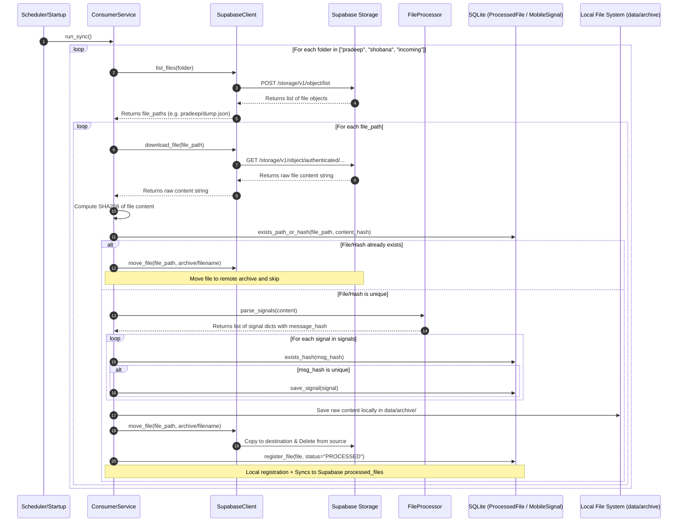

# Module 1 Review: Ingestion Service (ConsumerService)

This document provides a thorough analysis of the ingestion module (`ConsumerService`), which is responsible for pulling raw notification dumps from Supabase Storage and populating the local signal buffer.

---

## 1. Complete Code Flow

The execution logic of `ConsumerService` runs as follows:

---

## 2. Entry Methods

* **`ConsumerService.run_sync()`**: 
  * Initiated by `app/startup.py` during system bootstrapping, and periodically run by `JarvisScheduler` via the job ID `consumer_sync`.
  * Loops over the targeted users' Supabase folders to find and process export files.

---

## 3. Key Classes

1. **`ConsumerService`** (`consumer/consumer_service.py`): Coordinates the overall sync loop: fetching, validating, hash checking, parsing, inserting, archiving, and remote file relocation.
2. **`SupabaseClient`** (`consumer/supabase_client.py`): Interfaces directly with Supabase Storage REST endpoints utilizing `httpx`.
3. **`FileProcessor`** (`consumer/file_processor.py`): Performs JSON decoding and constructs unique signal hashes from raw properties.
4. **`ArchiveManager`** (`consumer/archive_manager.py`): Writes backup files to the local disk directory `data/archive/` using the relative paths from storage.

---

## 4. Key Functions

* **`ConsumerService._process_file(file_path)`**: Handles processing of a single file. Wraps the file-level deduplication, parsing, individual signal insertion, local archiving, remote archiving, and log registry writing.
* **`compute_message_hash(sender, message, timestamp)`**: Computes `SHA256` of `sender + message + timestamp` to produce a unique, deterministic footprint for every mobile signal.
* **`SupabaseClient.move_file(src_path, dest_path)`**: Copies a file to a new path in the bucket and deletes the original file. Falls back to manual downloading and uploading if the storage copy API fails.

---

## 5. Database Tables Touched

### Local SQLite Database
* **`processed_files`**: Checked to determine if a file (by storage path or content hash) has already been processed. Written to register files as `PROCESSED`, `FAILED`, or `SKIPPED`.
* **`mobile_signals`**: Written to store unique mobile notification records. Checked via `exists_hash()` using the computed message hash.

### Supabase Remote Database
* **`processed_files`**: Synced remotely via `SupabaseRepo.register_processed_file()` whenever a file completes processing or fails.

---

## 6. Supabase Folders Touched

All storage operations occur within the configured default bucket (defined by `settings.supabase_bucket`, default `jarvis-signals`).
* **Active Folders (Source)**:
  * `pradeep/`
  * `shobana/`
  * `incoming/`
* **Archive Folder (Destination)**:
  * `archive/` (receives completed files renamed as `archive/filename.json`)

---

## 7. Existing Functionality

1. **Dual Ingestion Paths**: Synchronizes folders for multiple users (`pradeep`, `shobana`) and general input (`incoming`).
2. **File-Level Deduplication**: Prevents re-importing the same files by checking both the remote path and the contents' SHA256 hash.
3. **Signal-Level Deduplication**: Prevents duplicate records within files using message-level hashes (generated from sender, message, and timestamp).
4. **Local Backup & Remote Cleanup**: Saves a copy on the host system to prevent data loss before relocating the file to the bucket's `archive/` folder.
5. **Fallbacks**: Implements a copy-and-delete remote move, with a fallback download-upload-delete path if the copy API fails.

---

## 8. Gaps

1. **Blocking Synchronous Network Calls**: All HTTP client operations (`httpx.get`, `httpx.post`, `httpx.request`) run synchronously, blocking the thread and increasing the scheduler's execution time.
2. **Hardcoded User Folders**: Folder names (`pradeep`, `shobana`, `incoming`) are hardcoded in the constructor instead of loading dynamically from configurations.
3. **No Retries or Backoff**: Network calls do not implement retry strategies. Temporary socket timeouts or Supabase rate-limits result in immediate process failures.
4. **Weak Payload Validation**: Decodes JSON dumps without validating types or structure, exposing the DB writer to malformed payload crashes.
5. **Potential File-Registry Desync**: If a file is successfully saved locally but the Supabase move API fails, the service will process the same file again on the next run.

---

## 9. Target Design

1. **Asynchronous Ingestion**: Refactor `ConsumerService` and `SupabaseClient` to use `asyncio` and `httpx.AsyncClient` to process folders and files concurrently.
2. **Dynamic Configuration**: Load the folders list dynamically from `settings` or `user_context.json`.
3. **Pydantic Validation**: Implement a strict Pydantic schema for signal payloads before ingestion.
4. **Retry Strategies**: Wrap `SupabaseClient` HTTP requests in retry wrappers using exponential backoff.
5. **Atomic Registrations**: Group file registry updates and storage moves to guarantee transaction safety.
