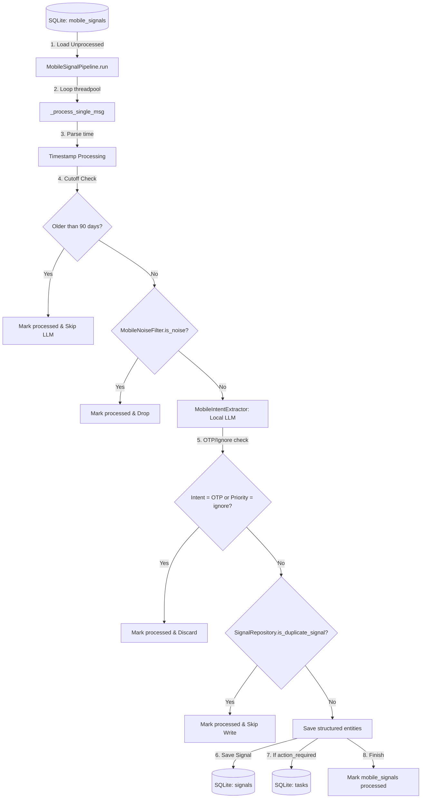

# Module 2 Review: MobileSignalPipeline

This review document details the architecture, input data schemas, timestamp processing rules, age threshold filters, noise filtering, and output definitions of the `MobileSignalPipeline` within Jarvis AI OS.

---

## 1. Architecture Flow

The execution pathway for a raw mobile notification signal conforms to the following flow:



---

## 2. Input Specifications

* **Table Read**: `mobile_signals`
* **Fields Evaluated**:
  * `id` (int): Internal primary key.
  * `device_id` (str): Identifier of the reporting phone/source.
  * `source` (str): Source network channel (e.g. `sms`, `whatsapp`).
  * `sender` (str): Sending number or chat group name.
  * `message` (text): Raw text contents of the notification.
  * `mobile_timestamp` (str): Original device-level epoch ms or ISO string.
* **Limits**: Fetches a maximum of 100 unprocessed records per execution run (`MobileSignalRepository.get_unprocessed_signals(limit=100)`).

---

## 3. Timestamp Handling

The original timestamp is fully preserved and propagated to downstream tables:
1. **Preservation**: The original device timestamp in `mobile_signals.mobile_timestamp` is parsed and preserved.
2. **Overwriting**: The timestamp is **not** overwritten with current processing time (`utcnow()`).
3. **Normalization**: The pipeline normalizes timestamps:
   * Translates numeric epoch strings (millisecond epoch if `val > 1e11`, otherwise second epoch).
   * Parses standard ISO-8601 strings and strips timezone offsets to store as naive UTC datetimes.
4. **Target Field**: The parsed datetime object (`original_timestamp`) is passed to `SignalRepository.create_signal()` and `TaskRepository.create_task()` as the `created_at` field.

### Code References
* Parsing logic: [mobile_signal_pipeline.py: L57-L70](file:///home/prad/petprojects/ai/jarvis/services/mobile_signal_pipeline.py#L57-L70)
* Repository invocation: [mobile_signal_pipeline.py: L128](file:///home/prad/petprojects/ai/jarvis/services/mobile_signal_pipeline.py#L128) and [L140](file:///home/prad/petprojects/ai/jarvis/services/mobile_signal_pipeline.py#L140)

---

## 4. 90-Day Operational Cutoff Filter

* **Application Point**: Checked in `MobileSignalPipeline._process_single_msg()` immediately after timestamp parsing and **BEFORE** any rules checks or LLM calls.
* **Cutoff Evaluation**:
  ```python
  cutoff_date = datetime.utcnow() - timedelta(days=90)
  if original_timestamp < cutoff_date:
      MobileSignalRepository.mark_signals_processed([msg.id])
      return
  ```
* **Result**: Bypasses all processing overhead for stale notifications, marking them processed in milliseconds.

---

## 5. Noise Filter Rules

The `MobileNoiseFilter` applies deterministic filtering rules prior to LLM execution:

| Rule Type | Filter Condition | Purpose | Example Message |
| :--- | :--- | :--- | :--- |
| **Empty Content** | `not message` | Discards empty or blank notifications | `""` |
| **OTP Keyword** | `"otp"`, `"verification code"`, etc. in message | Bypasses LLM and drops OTP codes | `"[SBI] 456789 is your OTP for transaction of..."` |
| **WhatsApp System** | `"checking for new messages"`, `"incoming call"`, etc. | Drops WhatsApp background/call noise | `"Checking for new messages..."` |
| **WhatsApp Media** | `"photo"`, `"video"`, `"sticker"`, `"gif"` without text | Drops media updates lacking textual details | `"photo"` |
| **SMS Noise** | `"tap to view"`, `"truecaller"`, `"overlay"` | Excludes notification overlays and spam | `"Tap to view new message in Truecaller"` |

---

## 6. WhatsApp Processing Analysis

Since WhatsApp is the primary signal source, processing is tailored as follows:
1. **Source Mapping**: Identifies items where `source == "whatsapp"`.
2. **Metadata Retained**:
   * Group Chat / Contact: Retained in the `sender` column (e.g. `"School Class Group"` or `"Spouse"`).
   * Device Origin: Retained in `device_id` to contextualize who collected the signal.
3. **Timestamps**: Inherited from the phone's native SQLite notification timestamps (represented in UTC milliseconds).
4. **Priority Rules**: Under the rules context, family and school-related updates are given high priority.

---

## 7. LLM Invocation Specifications

* **Local Model**: `qwen2.5:1.5b` (running on Ollama).
* **Context Prepending**: Dynamically constructs context rules from `user_context.json` via `ContextProvider.get_context_prompt()`. This instructs the LLM about user relationships (spouse: `Shobana`, children: `Charan`, `Chinicka`) and priority triggers.
* **Prompt Definition**: Explicit system prompt detailing field specifications (`intent`, `category`, `priority`, `action_required`, `due_date`, `summary`, `details`) and output constraints (strictly return raw JSON without markdown code blocks).

---

## 8. Output Table Mappings

### Table: `signals`
* `source`: `whatsapp`, `sms`, or `email`.
* `signal_type`: The extracted intent (e.g. `financial_transaction`, `school_update`, `personal_chat`).
* `category`: The normalized category (e.g. `finance`, `education`, `personal`, `shopping`).
* `importance`: The priority classification (`high`, `medium`, `low`).
* `summary`: Synthetic summary of the raw message.
* `raw_json`: Extracted metadata details (amount, paid_to, action items, etc.).
* `created_at`: The parsed original message timestamp.

### Table: `tasks`
* `title`: Summary text.
* `category`: Signal category.
* `priority`: Signal importance.
* `source`: Notification channel.
* `due_date`: Resolved due date (if actionable).
* `created_at`: Original message timestamp.

---

## 9. Quality Review (Message Transformation Examples)

Based on pipeline rules and prompt guidelines, raw signals translate as follows:

### 1. Family Message
* **Raw Message**: `[WhatsApp - Shobana] Don't forget to buy milk on your way back today.`
* **Pipeline Output (Signal)**:
  * Intent: `personal_chat`
  * Category: `personal`
  * Priority: `high` (due to spouse context)
  * Action Required: `true`
  * Details: `{"classification": "task", "action_items": ["buy milk"]}`
  * Task: Created in `tasks` with high priority.

### 2. School Message
* **Raw Message**: `[WhatsApp - Class Group] Charan's science project needs to be submitted by Friday.`
* **Pipeline Output (Signal)**:
  * Intent: `school_update`
  * Category: `education`
  * Priority: `high` (due to school priority)
  * Action Required: `true`
  * Details: `{"classification": "task", "action_items": ["Submit science project"]}`
  * Task: Created in `tasks` with high priority and due date calculated for Friday.

### 3. Financial SMS
* **Raw Message**: `[SMS - HDFCBK] Rs.450.00 debited from A/C ending 1234 on 23-06-26. Info: Swiggy.`
* **Pipeline Output (Signal)**:
  * Intent: `financial_transaction`
  * Category: `finance`
  * Priority: `high`
  * Details: `{"amount": "450.00", "currency": "INR", "paid_to": "Swiggy", "transaction_type": "debit", "payment_channel": "UPI"}`
  * Task: None created.

### 4. WhatsApp Chat (Informational)
* **Raw Message**: `[WhatsApp - Friends Group] Let's meet up sometime next week.`
* **Pipeline Output (Signal)**:
  * Intent: `personal_chat`
  * Category: `personal`
  * Priority: `high` (due to WhatsApp chat context)
  * Action Required: `false`
  * Details: `{"classification": "FYI", "message_content": "Meetup discussion"}`

### 5. OTP (Spam/Security)
* **Raw Message**: `[SMS - SBICRD] 123456 is OTP for your transaction of INR 100.00.`
* **Pipeline Output**: Dropped by `MobileNoiseFilter` before LLM processing.

### 6. Promotion
* **Raw Message**: `[SMS - Airtel] Get free subscription of Disney Hotstar today, click link.`
* **Pipeline Output**: Classifies as ignore / spam intent via rule-based pre-classification or LLM, resulting in immediate discard.

---

## 10. Gap Analysis

1. **Weak WhatsApp Deduplication**:
   * WhatsApp notifications can be repeated on the device (e.g. unread counters overlay notifications). If the same chat updates with a new message, the device export might include old messages in the list, creating signal-level duplicates.
2. **Missing Group Context**:
   * WhatsApp group names are read as the `sender` (e.g. `"Class Group"`), but the specific group participant who sent the message inside the group is often lost or merged into the message body, making it hard to track *who* said what.
3. **Regex Due Date Parsing Failures**:
   * Deterministic due date parsing in `SignalProcessor.parse_and_normalize_due_date()` occurs during the extraction phase rather than the pipeline phase, leading to duplicate date resolution code.
4. **OTP Rule Collisions**:
   * Transactions containing banking text sometimes trigger false noise drops if words like `"OTP"` appear in warnings (e.g., `"Never share your OTP for transaction of Rs.5000..."`), causing valid transaction alerts to be discarded.

---

## 11. Target State Recommendations

1. **Group Chat Participant Parsing**:
   * Refactor the pipeline to parse participant prefixes in WhatsApp group logs (e.g. `"Sender Name: Message text"`) and split them into structured metadata keys.
2. **Unified Regex Date Resolver**:
   * Shift date normalization entirely to the ingestion/pipeline layer so that `signals` tables always store clean, normalized `due_date` strings.
3. **Advanced Noise Exclusions**:
   * Refine OTP rules to ensure warnings about transaction safety that contain transaction amounts are preserved as financial warnings instead of being dropped as garbage.
